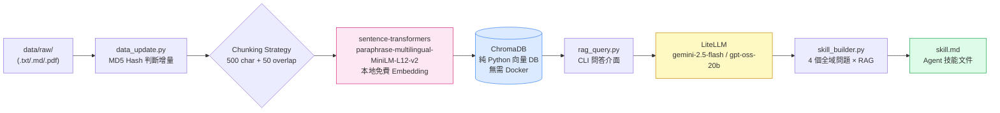

# US Stock Intelligence RAG System

> **HW3 — Build Your Personal RAG System**  
> 主題：美股科技龍頭情報分析（NVIDIA · Microsoft · Apple）

---

## 1. 專案簡介

### 知識主題
本系統針對美股三大科技龍頭（**NVDA、MSFT、AAPL**）建構個人知識 RAG 系統，整合：
- **SEC 官方財報**（10-K 年報、10-Q 季報），由 `edgartools` 自動抓取
- **基本面財務數據**（P/E、EPS、三大財務報表），由 `yfinance` 取得
- **近期市場新聞**，由 `gnews` + `newspaper4k` 爬取並解析正文

### 選題理由
美股科技龍頭財報、法說會實錄、產業分析報告均為公開資料，SEC EDGAR 提供免費 API 存取，`yfinance` 提供完整基本面數據，適合做為 RAG 系統的資料來源。這個領域對量化分析、投資研究有直接應用價值，產出的 `skill.md` 對研究人員有真實使用意義。

### 資料規模
- 資料類型：`.txt` 純文字（新聞正文、財務數據格式化輸出、SEC 財報萃取）
- 文件數量：20+ 份（初始手動準備，可使用 `fetch_data.py` 自動擴充）
- 涵蓋公司：NVDA（7 份）、MSFT（7 份）、AAPL（6 份）＋比較分析（1 份）

---

## 2. 系統架構說明



---

## 3. 設計決策說明（Design Decisions）

### Chunking 策略
- **選擇**：固定長度 500 字元 + 50 字元 Overlap
- **理由**：財報摘要和新聞文章的段落通常在 200–600 字元之間。固定長度保證每個 chunk 不超過 Embedding 模型的最佳輸入長度（句子層面），50 字元 Overlap 確保跨 chunk 的語意連貫性，避免關鍵數據（例如「毛利率 75%」）因切塊而語意斷裂。
- **替代方案考量**：段落切分（依`\n\n`）在格式化財報中效果好，但新聞正文的段落長度不一致，會造成非常短或非常長的 chunk，不如固定長度穩定。

### Embedding 模型
- **選擇**：`paraphrase-multilingual-MiniLM-L12-v2`（sentence-transformers 本地模型）
- **理由**：
  1. **完全免費**，不需要任何 API Key，首次執行自動下載（~420MB），之後完全離線
  2. 支援 **50+ 語言包含中文**，適合資料中夾雜中文分析說明的情境
  3. 向量維度 384，對 ChromaDB 的記憶體佔用低，適合本地端開發
- **替代方案考量**：`all-MiniLM-L6-v2`（速度快但僅英文）；`all-mpnet-base-v2`（品質更高但 420MB 且純英文）

### Vector DB
- **選擇**：ChromaDB（`chromadb` Python package）
- **理由**：
  1. 純 Python 套件，`pip install chromadb` 即可，**不需要 Docker**
  2. Windows 環境無需任何額外配置（pgvector 需要 Docker + PostgreSQL）
  3. 持久化儲存（`PersistentClient`）與記憶體模式均支援
  4. cosine similarity 原生支援，適合語意相似度搜索
- **替代方案考量**：pgvector 功能更強，支援 SQL metadata 過濾，但在 Windows 開發環境需要 Docker，增加設置摩擦

### Retrieval 策略
- **Top-k**：預設 5（可透過 `--top-k` 調整）
- **相似度度量**：cosine similarity（ChromaDB `hnsw:space: cosine`）
- **理由**：財報問答的 context 需要足夠豐富但不能太多（token 限制），5 個 chunk × 500 字元 = ~2,500 字元，在 gemini-2.5-flash 的 100K context window 中佔比極小，不影響生成品質

### Prompt Engineering
系統提示詞設計原則：
1. 嚴格框架（「僅根據以下參考資料回答」），避免 LLM 憑藉訓練知識「想像」數字
2. 強制引用格式（`[filename, chunk #N]`），讓使用者可以驗證來源
3. 明確處理「不知道」情況（無資料時直接告知，不胡亂推測）

### 冪等性設計（Idempotency）
- `data_update.py` 計算每個 `data/raw/` 檔案的 MD5 hash，存入 `hashes.json`
- 每次執行比對當前 hash 與儲存的 hash，若相同則跳過
- `--rebuild` 時：清空 `data/processed/`、刪除 ChromaDB collection、清除 `hashes.json`
- 確保：即使重複執行，向量庫不會累積重複 chunk

### skill_builder.py 問題設計
設計 4 個全域問題，覆蓋不同知識層面：
1. **Core Technologies**：技術護城河（CUDA、Azure AI、Apple Silicon）
2. **Financials**：具體財務數據（毛利率、成長率、自由現金流）
3. **Risks**：市場風險、競爭威脅、監管挑戰
4. **Strategy**：未來成長方向（AI、雲端、機器人、服務業務）

---

## 4. 環境設定與執行方式

### 開發環境
- **Python 版本**：3.11.9（需 >= 3.10）
- **作業系統**：Windows 11 / Ubuntu 22.04
- **Vector DB**：ChromaDB（純 Python，**不需要 Docker**）

### 4-1. 確認 Python 版本與建立虛擬環境

```bash
# Step 0: 確認 Python 版本（需 >= 3.10）
python --version   # Windows
# python3 --version  # Linux/macOS

# Step 1: 建立虛擬環境
python -m venv .venv       # Windows
# python3 -m venv .venv    # Linux/macOS

# Step 2: 啟動虛擬環境
.venv\Scripts\activate     # Windows PowerShell
# source .venv/bin/activate  # Linux/macOS

# 啟動後命令列出現 (.venv) 前綴

# Step 3: 安裝套件
pip install -r requirements.txt
```

> ⚠️ 首次安裝 `sentence-transformers` 時，程式執行會自動從 HuggingFace 下載 Embedding 模型（~420MB），請確保網路暢通。

### 4-2. Vector DB 啟動
本系統使用 **ChromaDB（純 Python）**，**不需要**啟動 Docker 或任何外部服務。ChromaDB 資料庫會自動建立在 `./chroma_db/` 目錄中。

> 如果你想改用 pgvector，請參考 `.env.example` 中的 `PGVECTOR_CONNECTION_STRING` 設定，並準備對應的 `docker-compose.yml`。

### 4-3. 設定環境變數

```bash
# Step 4: 複製環境變數範本
cp .env.example .env     # Linux/macOS
# copy .env.example .env   # Windows

# 編輯 .env，填入助教提供的 LiteLLM 設定：
# LITELLM_API_KEY=助教提供的 API Key
# LITELLM_BASE_URL=助教提供的 Endpoint URL

# SEC_IDENTITY 填入你的姓名和 email（SEC EDGAR 公平存取政策要求）
# SEC_IDENTITY=Your Name your.email@example.com
```

### 4-4. 完整執行流程

```bash
# ① 確認 Python 版本
python --version        # 需顯示 >= 3.10.x

# ② 建立並啟動虛擬環境
python -m venv .venv
.venv\Scripts\activate  # Windows（Linux/macOS: source .venv/bin/activate）

# ③ 安裝套件
pip install -r requirements.txt

# ④ 設定環境變數
copy .env.example .env
# 編輯 .env，填入 LITELLM_API_KEY、LITELLM_BASE_URL、SEC_IDENTITY

# ⑤ ChromaDB 不需要 Docker，直接跳過 docker compose up

# ⑥ 全量重建索引（清空並重建）
python data_update.py --rebuild

# ⑦ 測試 RAG 問答
python rag_query.py --query "NVIDIA 最新財報的毛利率是多少？" --model gpt-oss:20b
python rag_query.py --query "Microsoft 最新財報的毛利率是多少？" --model gpt-oss:20b
python rag_query.py --query "Microsoft 目前有什麼有利或是不利的新聞？" --model gpt-oss:20b
python rag_query.py --query "Apple 最近的 iPhone 銷售狀況如何？" --model gpt-oss:20b

# ⑧ 生成 Skill 文件
python skill_builder.py --output skill.md

# 可選：互動式多輪對話模式
python rag_query.py
```

### 4-5. 可選：使用 fetch_data.py 自動擴充資料

```bash
# 自動抓取 NVDA、MSFT、AAPL 的新聞、SEC 財報、基本面
python fetch_data.py

# 指定特定 ticker
python fetch_data.py --tickers NVDA TSLA GOOGL

# 只抓 3 篇新聞（加速測試）
python fetch_data.py --news-count 3

# 只抓基本面（跳過新聞和 SEC，速度最快）
python fetch_data.py --skip-news --skip-sec
```

---

## 5. 資料來源聲明（Data Sources Statement）

| 來源名稱 | 類型 | 授權 / 合規依據 | 數量 |
|---|---|---|---|
| SEC EDGAR（10-K / 10-Q） | 官方財報 | 美國 SEC 公開資料，完全免費公開 | 每公司各 2 份 |
| Yahoo Finance（yfinance） | 基本面數據 | Yahoo Finance 公開服務條款，個人使用合規 | 每公司各 2 份 |
| Google News + 財經新聞正文 | 新聞文章 | 公開新聞，個人研究使用（fair use） | 每公司最多 5 篇 |
| 手動整理的公開分析文件 | 摘要文本 | 個人著作整理自公開資料（Investor Relations 等） | 共 8 份 |

> ⚠️ 所有資料均來自公開管道，不含任何付費牆內容或重大非公開資訊（MNPI）。

---

## 6. 系統限制與未來改進

### 當前限制
1. **資料截止日期**：初始資料收集於 2025 年 4 月初，不含最新法說會或突發事件
2. **中文新聞支援有限**：gnews 以英文新聞為主，中文財經媒體（如鉅亨網）需另行實作爬蟲
3. **SEC 財報文字量過大**：10-K 原始文本超過 200K 字元，目前截取前 60,000 字元，可能遺漏後段資訊
4. **無 Reranking**：使用純向量相似度，未實作 cross-encoder reranking 提升 precision

### 未來改進方向
1. **BM25 + 向量混合搜索（Hybrid Retrieval）**：結合關鍵字搜索與向量搜索，提升召回率
2. **Cross-encoder Reranking**：在 top-k 向量結果後，使用 `cross-encoder/ms-marco-MiniLM-L-6-v2` 精排
3. **結構化 Metadata 過濾**：在 ChromaDB 查詢中加入 `where={"ticker": "NVDA"}` 過濾，提升精準度
4. **Yahoo Finance RSS 定期更新**：整合 `feedparser` 解析 Yahoo Finance RSS，每日自動更新新聞
5. **GraphRAG 知識圖譜**：建立公司 → 產品 → 技術 → 競爭者 的知識圖譜關係，提升多跳推理能力

---

## 7. 常見問題

**Q：執行 `python data_update.py --rebuild` 時卡在 Embedding 模型下載？**  
A：首次執行會自動從 HuggingFace 下載 `paraphrase-multilingual-MiniLM-L12-v2` 模型（~420MB）。請確保網路暢通，並耐心等待。下載完成後，後續執行完全離線。

**Q：`fetch_data.py` 抓取新聞失敗（newspaper4k 報錯）？**  
A：部分財經網站有防爬蟲機制（401/403 回應）。程式已內建 `try/except`，失敗的 URL 會自動跳過，不影響整體執行。可使用 `--skip-news` 跳過新聞抓取。

**Q：edgartools 連接 SEC EDGAR 超時？**  
A：SEC EDGAR 會限速過於頻繁的請求。`fetch_data.py` 每次請求間隔設為 2 秒。若仍超時，可以使用 `--skip-sec` 跳過，使用 `data/raw/` 中已預備的靜態資料。

**Q：可以使用 pgvector 而非 ChromaDB 嗎？**  
A：可以。修改 `data_update.py` 和 `rag_query.py` 中的 DB 初始化邏輯，切換至 `psycopg2` 連接 pgvector，並在 `.env` 中設定 `PGVECTOR_CONNECTION_STRING`。需額外提供 `docker-compose.yml`。

---