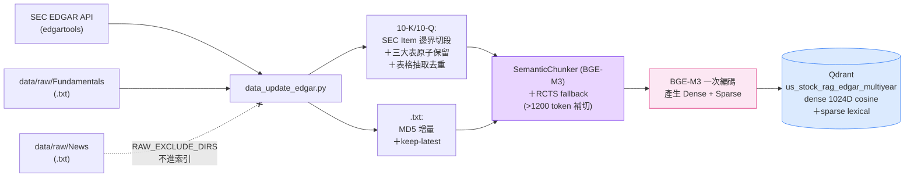
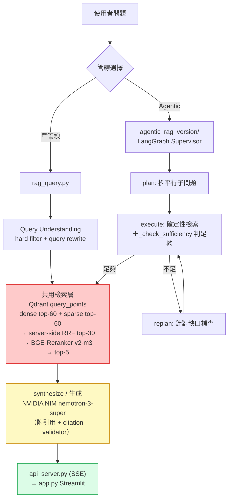

# US Stock Intelligence RAG System

> 主題：美股科技龍頭情報分析（Apple · Microsoft · NVIDIA · Amazon · Alphabet · Meta · Tesla）

### 文件導覽

本檔是**對外說明**：這個系統是什麼、怎麼裝、怎麼跑、為什麼這樣設計。其餘文件各有單一職責：

| 想知道 | 看哪一份 |
|---|---|
| **現在的狀態**（生產 collection、題庫、閘門數、量尺狀態） | [`CLAUDE.md`](CLAUDE.md) 開頭的〈現況快照〉 |
| 架構、全域規則、每個檔案負責什麼 | [`CLAUDE.md`](CLAUDE.md) |
| 語料怎麼切塊、重建要注意什麼 | [`docs/INGEST.md`](docs/INGEST.md) |
| 怎麼評測、哪些數字可以相信、**哪些做法已試無效** | [`docs/EVAL.md`](docs/EVAL.md) |
| agentic 管線各節點為什麼這樣設計 | [`docs/AGENTIC.md`](docs/AGENTIC.md) |
| 還沒做的事、已接受的極限 | [`BACKLOG.md`](BACKLOG.md) |
| 什麼時候改了什麼 | [`CHANGELOG.md`](CHANGELOG.md) |

---

## 1. 專案簡介

**知識主題**：美股七大科技龍頭（AAPL、MSFT、NVDA、AMZN、GOOGL、META、TSLA）的個人知識 RAG，整合
**SEC 官方財報**（10-K／10-Q，`edgartools` 呼叫 SEC EDGAR API）與**基本面財務數據**（P/E、EPS、毛利率、三大報表，`yfinance`）。
新聞是 `--with-news` opt-in，**預設不抓、抓了也不進索引**（見下）。

**資料規模**

| 類別 | 檔案數 | 說明 |
|---|---|---|
| SEC filing（10-K／10-Q） | **77** | 每家 3 份年報 ＋ 8 份季報，橫跨約 2.5 年 |
| Fundamentals／IncomeStatement | 14 | 每家各 2 份 `.txt`，只保留最新快照 |
| **合計進索引** | **91** | → 生產 collection `us_stock_rag_edgar_multiyear` 共 **13,022 chunks** |
| News | 24 | `.txt` 仍在磁碟上，但**不進索引** |

> **KB 只收「記錄」，不收「流」**：新聞由 agentic 的 live web 路徑供應，不進 Qdrant。判準是「這份東西的正確性靠什麼判定」——記錄靠期別對＋有引用＋數字可驗，流靠夠新＋來源可信，本專案為期別正確性做的每一層對新聞沒有一項成立。
>
> **多年語料 2026-08-27 升生產**（單年 21 份 → 77 份），兩半證據都量過：損害是 45 題掉 2 題、錯期率 0.000 → 0.044；收益是歷史題 gold@5 從 0/20 變 18/20，而當期題的陰性對照不動。

---

## 2. 系統架構

### 2-1. Ingest（建索引）



### 2-2. Query（兩條管線，共用同一個 collection 與檢索層）



> 檔案分工、現行參數、各模組角色以 [`CLAUDE.md`](CLAUDE.md) 為單一真相來源。

---

## 3. 設計決策說明（Design Decisions）

### Chunking 策略
- **選擇**：`SemanticChunker`（BGE-M3 dense embedding 判語意邊界）＋ **RCTS fallback** 補切超長 chunk，外加 SEC filing 的結構處理。
- **理由**：財報段落長度落差很大（一句話的財務數據 vs 整段 MD&A），固定長度切法要嘛切斷語意單元、要嘛留下大量填充。
- **SEC filing 的額外結構處理**：① **Item 邊界限制範圍**（語意切割只在同一個 Item 內，避免跨章節合併）② **三大表原子保留**（income statement／balance sheet／cash flow 各整份一個 chunk）③ **附註表格額外抽取＋去重**（用「大數字集合重疊度」與三大表比對，避免 MD&A 重複貼的損益表被算兩次）。
- **RCTS fallback（`--rcts-fallback`）**：chunk 超過 1200 reranker token 時用 `RecursiveCharacterTextSplitter`（800/80，length function 用 reranker 自己的 tokenizer）補切。**預設關但生產必須開**——不開的話約 7.4% 的 chunk 會超過 `RERANK_MAX_LENGTH=2048` 截斷點，超出部分在精排階段等於看不到。
- **替代方案**：固定長度 + overlap 簡單，但財報數字容易被切在邊界；依 `\n\n` 段落切分在格式化財報尚可，新聞正文則不穩定。
- 完整六層與踩過的坑見 [`docs/INGEST.md`](docs/INGEST.md)。

### Embedding 模型：`BAAI/bge-m3`
- **免費開源、無需 API Key**，首次自動從 HuggingFace 下載（~2.3GB），之後完全離線。
- **一個模型同時產生 Dense + Sparse（+ 選用 ColBERT）**——這是 hybrid retrieval 的關鍵：不必維護兩套 embedding pipeline。
- 支援 100+ 語言含中文；dense 1024 維，sparse 是 lexical weight dict（`token_id → weight`），可直接做類 BM25 的 keyword matching。
- **替代方案**：`MiniLM` + `rank_bm25` 要維護兩個獨立元件且 BM25 無語意泛化；SPLADE 是純 sparse；OpenAI embedding 收費且無 sparse。

### Hybrid Retrieval + RRF Fusion
- **動機**：純向量檢索會漏掉精確關鍵字（「毛利率 75%」「Q4 FY2025」），純關鍵字檢索缺語意泛化。
- **架構**（dense + sparse 同 point、同一個 collection）：

  ```
  query ─► BGE-M3 encode ─┬─ q_dense ──┐
                          └─ q_sparse ─┤
                                       ▼
              client.query_points(prefetch=[dense limit=60, sparse limit=60],
                                  query=FusionQuery(RRF), limit=30)   ← 單一 API call
                                       ▼
                     BGE-Reranker v2-m3（cross-encoder，輸入上限 50）
                                       ▼
                                  top-5 → LLM
  ```
- **RRF 公式**：`score(d) = Σ 1 / (k + rank_i(d))`，k=60。rank-based 融合不需校正兩條 retrieval 的分數尺度（dense cosine ∈ [0,1]，sparse 是無上界 dot product），且由 Qdrant server 端執行。
- **參數取捨**：每路 prefetch 取 60（寬召回，60 與 30 幾乎同速）；**RRF 回 30**（2026-09-11 在 multiyear 上重量：20→30 救回 3 題、退步 0 題，而 50 相對 30 是純浪費——`RERANK_INPUT_N=50` 是重排輸入上限，第 31~50 名沒有一個含 gold）。⚠ 成本是單次檢索 28.8s → 41.9s，取捨理由見 `CLAUDE.md`〈已知帶著上線的取捨〉。
- **Sparse 儲存**：直接進 Qdrant 的 `sparse` named vector（inverted index），**不需要額外維護本地 pickle 索引**。

### Vector DB：Qdrant
- **原生支援 hybrid**（單一 collection 內多個 named vectors，一筆 point 同時持有 dense + sparse，ChromaDB 做不到）。
- **Server-side RRF Fusion**：一次 API call 完成兩路檢索 + 融合。
- **payload filter + keyword index**：`source`／`doc_type`／`item_id`／`period_basis`／`mentioned_tickers` 都建了索引，硬性條件過濾走索引而非全掃。
- **可平滑遷移**：`make_qdrant_client()` 依 `.env` 有無 `QDRANT_URL` 自動切 server／local。
- **替代方案**：ChromaDB 不支援 sparse；Milvus Lite API 較複雜；pgvector 需 PostgreSQL 且 sparse 門檻高；Weaviate 本地模式需 Docker。

### Local mode → Docker Qdrant（2026-07 的架構調整）
原本用 `QdrantClient(path="./qdrant_db")` 嵌入式模式，但那是**排他檔案鎖**——互動查詢、eval 腳本、`api_server.py` 會互搶鎖而報錯。改跑 Docker Qdrant 後三者可併發；**local mode 仍保留當 fallback**（不設 `QDRANT_URL` 即自動退回），適合單人單 process 的快速實驗。

### Retrieval 策略
- **Top-k**：預設 5（`--top-k` 可調）。
- **流程**：`query_points`（dense 60 + sparse 60 → RRF 30）→ 若觸發 query rewrite，各變體 top-8 去重併入 → cross-encoder rerank（輸入上限 50）→ top-5。
- **相似度**：dense 走 cosine；sparse 走 BGE-M3 lexical weights 的 inverted-index dot product。

### Query Rewrite（多變體改寫）
口語／開放式問題（「輝達的護城河是什麼」）用原始詞面容易漏掉財報術語寫的段落。做法是先用 LLM 生成 2 個財經術語變體，各自檢索後取 **top-8**（`VARIANT_CAP`）併入主池，依 score 去重。

| 合併策略 | ckpt_R | critical-miss |
|---|---|---|
| 無 rewrite | 51.9% | 50.0% |
| rewrite（無 cap） | 39.1% | 50.0% |
| **rewrite + 每變體 cap=8**（採用） | **57.1%** | **30.0%** |
| rewrite + RRF-fusion（跨變體） | 49.0% | 50.0% |

**無 cap 會被單一強勢變體灌水**；RRF-fusion 理論上該解決這問題，實測反而更差——融合出來的 pool 是「各變體排名妥協」的結果，任何單一 query 看都不是最相關的。

### Query-Understanding Hard Filter
- 檢索前用 LLM 抽 `fiscal_year`／`fiscal_period`／`filing_type`（含 include/exclude 極性），轉成 Qdrant `must`／`must_not` filter。
- **公司（ticker）走兩段式**：字面公司名（含中文別名「輝達」「特斯拉」）用 regex 字典；**regex 沉默時**才叫一次 LLM 做實體解析（AWS → AMZN、Azure → MSFT）。
  > **為什麼不往字典加一筆 `"aws": "AMZN"`**：那是 O(n) 的開始。實測 20 個一般人會用的產品名有 18 個抽不到，而這種名字每季都在長。字典做的是**格式已知的字面比對**，實體解析是**開放集合的感知**。
  > **只在 regex 沉默時才叫**，理由不是省錢是精度：regex 命中的是字面公司名，那是高精度的。
- **期間意圖也交給 LLM**：「這題問的是哪個期間」（`latest`／`absolute`／`range`／`none`）沒有唯一機械答案 → LLM 判；「那個期間是哪個期碼」是確定性的 → Python 從 collection 的期別階梯算。
- **口徑消歧義（`period_basis`）**：ingest 時就標上數字口徑（Fundamentals ＝ TTM、10-K/Q ＝ fiscal_year），問「最近十二個月」時**單向**硬性導向 Fundamentals。
- **Tier cascade**：嚴格 filter 零結果時自動退寬鬆（拿掉年份留 ticker+type）→ 再退無 filter。
  > ⚠ **「Tier 1 命中」不等於「答得了」**：label-year 現在**只能放寬命中、不能自己構成命中**（否則問 FY2025 會命中一份「曆年標籤 2025、財年其實 2026」的季報，而真正含答案的年報反被擋掉）。

### Agentic 管線
單管線對「一次要回答多件事」或「必須先查 A 才知道要查 B」力有未逮，因此另建 LangGraph Supervisor 管線：

| 節點 | 做什麼 |
|---|---|
| `plan` | 把問題拆成可平行處理的子問題，並標出每個子問題的 `route`（kb／web／both）與 `depends_on` |
| `execute` | **確定性**檢索（無 LLM 改寫），再由 `_check_sufficiency` 判證據是否足夠 |
| `replan` | 證據不足時針對缺口補查（多跳題的「查完 A 才知道要查 B」在此解決） |
| `synthesize` | 生成 ＋ 六道修補鏈（citation／一致性／期別／reflect／數字溯源／並陳）＋ 零成本的接受守衛 |

- **關鍵設計：Execute 不放 LLM 改寫**。早期讓 ReAct agent 自由改寫子查詢，實測是檢索品質退步的主因（乾淨 decomposition 的 gold-chunk 覆蓋 35/75 vs 真實 ReAct 16/75）。
- **時間感知雙軸 `freshness_mode`**：`snapshot`（eval 用，「最新」＝知識庫裡最新的資料，不看系統時鐘，確保可重現）／`live`（生產用，看實際日期）。
- **成本**：agentic 一題燒 50~60 次 LLM 呼叫，單管線 3~4 次。
- 節點設計理由與 validator 實測見 [`docs/AGENTIC.md`](docs/AGENTIC.md)。

### Prompt Engineering
1. 嚴格框架（「僅根據以下參考資料回答」），避免憑訓練知識想像數字。
2. 強制引用格式（`[filename, chunk #N]`），使用者可驗證來源。
3. 明確處理「不知道」（無資料時直接說，不推測）。
4. **多公司題強制逐家點名**：正文必須把每家的數據綁到公司名寫進句子，citation 標記本身不算 attribution。
5. **單位紀律（Rule 11）**：來源 `$X billion` 原樣保留、不要自己換算成億——換算由**純程式**做（`rq.finalize_answer_units`），因為 billion→億 是 ×10 而 LLM 的翻譯層 token 習慣會算錯位數。

### 生成溫度分工
- **檢索側（query filter／rewrite）與 eval judge：`temperature=0`** — 確定性、可重現。
- **生成答案：`temperature=0.3`（`GEN_TEMPERATURE`）** — 實測 temp=0 的 greedy decoding 會重複／mode collapse，反而漏掉評分要點（凍住檢索的對照組：correctness 0.518 → 0.609）。

### 冪等性設計
- **`.txt`（Fundamentals／IncomeStatement）**：MD5 存進 `hashes_edgar.json`，**以 collection 為第一層 key**（避免「A collection 已 ingest 過」誤讓 B 跳過）。`--force-txt` 可繞過。
- **SEC filing**：**不做 hash 快取**（同一 accession number 內容不再變動，且要抓回來才存在，加快取省不到 API 呼叫）。改以「依 `source` 刪除舊 points 再 upsert」保證重跑正確。
- **keep-latest**（Fundamentals／IncomeStatement）：同一公司只留最新快照，並**主動刪除過期快照殘留的 chunk**；10-K/10-Q 則允許多期並存。
- Point ID 用 deterministic UUID（`uuid5(NAMESPACE_DNS, chunk_id_str)`），同一 chunk 重跑 ID 不變。
- > **重建不會逐字重現舊 collection**（SEC 換版 ＋ LLM 表格摘要非確定性）。判斷重建是否正常，看的是「扣掉換版文件後 **text chunk** 是否逐字相同」，不是總 chunk 數。

---

## 4. 環境設定與執行方式

### 開發環境
- **Python**：3.11.9（需 >= 3.10）
- **作業系統**：Windows 11 / Ubuntu 22.04
- **Vector DB**：Qdrant，推薦 Docker server 模式（見 4-2），也支援 local embedded mode 當 fallback

### 4-1. 建立虛擬環境

本專案需要**兩個互相隔離的虛擬環境**：

```bash
python --version                       # 需 >= 3.10

# ① 生產環境：查詢、agentic、ingest 都跑在這裡
python -m venv .venv
.venv\Scripts\activate                 # Linux/macOS: source .venv/bin/activate
pip install -r requirements.txt

# ② 評測環境：只給 RAGAS 用
python -m venv .venv-ragas
.venv-ragas\Scripts\activate           # Linux/macOS: source .venv-ragas/bin/activate
pip install -r requirements-ragas.txt
```

> ⚠️ **兩個環境不能合併**：`ragas 0.2.x` 綁 `langchain-core<0.4`，而生產端的 LangGraph agentic 管線與 `SemanticChunker` 需要 `langchain 1.x`。裝在一起時後裝的會覆蓋先裝的，結果是生產管線壞掉。實測差異：`.venv` 是 langchain 1.3.14 / langgraph 1.2.9，`.venv-ragas` 是 langchain 0.3.30 / ragas 0.2.15。

> ⚠️ 首次執行會自動從 HuggingFace 下載 `BAAI/bge-m3`（~2.3GB）與 `BAAI/bge-reranker-v2-m3`（~2.3GB），請確保網路暢通。下載完成後後續執行完全離線。

### 4-2. Vector DB 啟動

**推薦：Docker Qdrant（支援多 process 併發存取）**

```bash
docker run -d --name qdrant --restart unless-stopped -p 6333:6333 -p 6334:6334 \
  -v ./qdrant_docker_storage:/qdrant/storage qdrant/qdrant:v1.19.0
```

啟動後在 `.env` 設定 `QDRANT_URL=http://localhost:6333`。所有腳本透過 `make_qdrant_client()` 自動偵測並走 server 模式。

⚠ **容器起來 ≠ 可以連**：Qdrant 會逐個 collection 恢復 shard（本機 9 個 collection 實測約 **22 秒**）才開始 listen。那段期間 client 會拿到 `RemoteProtocolError: Server disconnected without sending a response`——**那不是壞掉，是還沒好**。先 `docker logs qdrant | tail` 看到 `Qdrant HTTP listening on 6333` 再連。

**替代：Local embedded mode（單人快速實驗，不需 Docker）**

`.env` 把 `QDRANT_URL` 留空即可，自動 fallback 到 `QdrantClient(path=QDRANT_PATH)`，資料庫建在 `./qdrant_db/`。**注意**：local mode 是排他檔案鎖，同一時間只能有一個 process（互動查詢 / eval / API server 三選一）打開它。

### 4-3. 設定環境變數

專案未附 `.env.example`，直接新增 `.env`：

| 變數 | 必填 | 用途 |
|---|---|---|
| `NVIDIA_API_KEY` | ✅ | `rag_query.py` / `agentic_rag_version/` 的預設 LLM（NVIDIA NIM `nvidia/nemotron-3-super-120b-a12b`），也是 RAGAS judge 走的 endpoint |
| `SEC_IDENTITY` | ✅ | 格式 `Your Name your.email@example.com`，SEC EDGAR 公平存取政策要求 |
| `QDRANT_URL` | 建議 | `http://localhost:6333`；留空則走 local embedded mode（`QDRANT_PATH` 可覆蓋路徑） |
| `GROQ_API_KEY` | 建議 | **ingest 對無 caption 的大表格生成摘要**（`openai/gpt-oss-20b`）。缺它時大表格沒有 caption |
| `TAVILY_API_KEY` | 選用 | agentic 的 live web 搜尋（`freshness_mode=live` 才會用到；eval 預設 snapshot 不需要） |
| `GEMINI_API_KEY` | 選用 | 只有改用 `-m gemini-*` 模型時 |
| `RAG_COLLECTION` | 選用 | 覆蓋生產 collection 名稱（**跑實驗請用它，不要改碼**） |

### 4-4. 完整執行流程

```bash
# ① 確認 Python 版本、② 建虛擬環境、③ 安裝套件         → 見 4-1
# ④ 建立 .env                                        → 見 4-3
# ⑤ 啟動 Docker Qdrant                                → 見 4-2

# ⑥ 全量重建索引 ── ⚠ --rcts-fallback 不可省（預設是關的）
python data_update_edgar.py --rebuild --rcts-fallback --collection us_stock_rag_edgar_multiyear

# ⑦ 單管線問答（不加 -m 就用預設的 NVIDIA nemotron-3-super）
python rag_query.py -q "NVIDIA 最新財報的毛利率是多少？"
python rag_query.py -q "NVIDIA 最新財報的毛利率是多少？" -m gemini-2.5-flash   # 改走 Gemini

# ⑧ Agentic 管線（多步驟拆解 + 自我檢核，適合複合題 / 多跳題）
python -m agentic_rag_version -q "比較 NVIDIA 與 Tesla 最新一季的毛利率差距"
python -m agentic_rag_version -q "..." -v          # 印節點決策與中間輸出

# 互動式多輪對話
python rag_query.py
```

**語料目錄結構**（`data/raw/`，掃描是**遞迴**的）：

| 目錄 | 內容 | ingest 行為 |
|---|---|---|
| `Filings/` | 10-K / 10-Q `.html`（primary document） | 供人眼查閱，**ingest 不讀這裡** |
| `sec_local/` | `filings/{YYYYMMDD}/{accession}.nc` 完整申報檔 | **ingest 的 10-K/10-Q 唯一來源** |
| `Fundamentals/` | Fundamentals + IncomeStatement `.txt` | 讀取，套 keep-latest |
| `News/` | News `.txt` | **整個目錄排除**（`RAW_EXCLUDE_DIRS`） |
| `_archive_stale/` | 過期快照 | **整個目錄排除** |

⚠ 掃描改回非遞迴的 `iterdir()` 會掃到 0 個檔案，而且**不報錯**，只是安靜地少 ingest 一批 `.txt`。人眼驗證用的傾印輸出在 `data/edgar_processed/`，鏡像同樣的分類。

### 4-5. 可選：使用 fetch_data.py 擴充資料

```bash
python fetch_data.py                                    # 抓 SEC 財報 + 基本面（新聞預設不抓）
python fetch_data.py --tickers NVDA TSLA GOOGL          # 指定 ticker
python fetch_data.py --annuals 3 --quarters 8           # 現行生產語料的份數
python fetch_data.py --skip-sec                         # 只抓基本面（最快）
python fetch_data.py --with-news --news-count 3         # 明確要新聞才會抓（仍不進索引）
```

### 4-6. 可選：Web 前端（Streamlit + FastAPI + SSE 串流）

架構是 **FastAPI 後端 + Streamlit 前端**，原因是被三個限制綁死：模型暖機成本高（BGE-M3 + reranker 常駐約 8–10GB RAM，不能每個請求重載）、職責分離（前端純走 HTTP、不碰 Qdrant）、CPU rerank 每題數分鐘（用 SSE 串流，在出 token 前先回報「檢索中／重排中／生成中」）。

```powershell
# 視窗 A：後端（載入模型）
uvicorn api_server:app --port 8000

# 視窗 B：前端（純 HTTP client，不碰向量庫）
streamlit run app.py
```

健康檢查：`GET http://localhost:8000/health` 回報實際 collection 名稱與 chunk 數，可立即確認模型載入、Qdrant 連上、collection 選對。

---

## 5. 評測（Evaluation）

| 項目 | 內容 |
|---|---|
| 題庫 | [`eval/eval_set.json`](eval/eval_set.json)，**65 題**：semantic 15／mixed 15／lexical 17／colloquial 13／multi_hop 5 |
| 冷凍題庫 | [`eval/eval_set_news.json`](eval/eval_set_news.json) 37 題。**現在不要拿它跑分**（eval 預設 web 是關的，跑了必然全滅，那不是證據） |
| 參考答案 | `gen_reference_answers.py` 從黃金來源檔生成 → `reference_answers.json`（RAGAS 的 ground truth） |
| 聚合指標 | RAGAS 六項：context_recall、context_precision、nv_context_relevance、faithfulness、answer_relevancy、answer_correctness |
| **零噪音指標** | `check_*.py` 逐條斷言（PASS／FAIL／**N/A** 三態）＋ 一組確定性閘門（`verify_*.py`，零 LLM、秒級）。**「數字答對了沒有」用這些驗收，不是 RAGAS** |
| 執行環境 | RAGAS 須跑在**獨立的 `.venv-ragas`** |

> ⚠ **量測解析度比多數改動的效果粗一個數量級**：RAGAS 的 MDE（95%）換算成「要幾題從 0 修到 0.5」是 **4~7 題**，而典型 ingest 改動只動 2~5 題。看到聚合分數差異時**先問「這超過噪音嗎」再問「為什麼」**。判讀護欄由 `eval_ragas_vs_rubric.py` 每次跑完自動印出。完整說明見 [`docs/EVAL.md`](docs/EVAL.md)。

標準跑法（三步，reference 生成一次即可重用）：

```bash
# 1. 生成參考答案（已存在就不必再跑）
python eval/gen_reference_answers.py

# 2. 產生結果檔（agentic 版；單管線版改跑 eval_generation_llm_judge.py）
python eval/run_agentic_on_evalset.py --module agentic_rag_version \
    --freshness-mode snapshot --output experiments/agentic/<名稱>.json

# 3. 切到 .venv-ragas 算指標
.venv-ragas/Scripts/python.exe eval/eval_ragas_vs_rubric.py \
    --from-results experiments/agentic/<名稱>.json \
    --reference-file eval/reference_answers.json --output experiments/agentic/ragas_<名稱>.json
```

> 腳本清單與各自跑在哪個 venv 見 [`CLAUDE.md`](CLAUDE.md) 的 Eval 表；實驗結論記錄在 [`CHANGELOG.md`](CHANGELOG.md)。

---

## 6. 資料來源聲明

| 來源 | 類型 | 授權／合規依據 | 數量 |
|---|---|---|---|
| SEC EDGAR（10-K／10-Q） | 官方財報 | 美國 SEC 公開資料，完全免費公開 | 每公司 11 份，共 **77** |
| Yahoo Finance（yfinance） | 基本面數據 | Yahoo Finance 公開服務條款，個人使用合規 | 每公司 2 份，共 14 |
| Yahoo Finance News API | 新聞文章 | `--with-news` opt-in | 24 篇，**不進索引** |

> ⚠️ 所有資料均來自公開管道，不含任何付費牆內容或重大非公開資訊（MNPI）。SEC EDGAR 的存取遵守其公平存取政策：`.env` 需提供 `SEC_IDENTITY`（真實姓名 + email），並限制請求頻率。

---

## 7. 系統限制與未來改進

### 當前限制
1. **否定框架的檢索落差** — 「非龍頭」「不是最大的」這類問法與語料的正面表述（"minority share"）存在框架落差，跨語言翻譯救不了。
2. **多公司題沒有期別保護** — `build_qdrant_filter` 吃 flat AND list，結構上寫不出 per-ticker 的 OR-of-ANDs。實測損害是**席位競爭**（top-5 被一家壟斷）而非選錯期別，且只發生在單管線——agentic 的 planner 會在上游把多公司題拆成單公司子問題。
3. **集合詞題不支援** — 「Magnificent Seven」「這些科技巨頭」解不出任何 ticker，逐家保底整個不觸發。已登錄為極限（見 `BACKLOG.md`）。
4. **表格摘要非確定性** — 無 caption 的大表格靠 LLM 生成一行摘要，重建索引時這部分無法逐字重現（每份 filing 約 2~3 個 chunk；**text chunk 完全不受影響**）。
5. **重述（restatement）無法區分** — 10-K 會重述前一年數字，於是同一個事實在新舊年報是兩個值，而 payload 沒有 `filing_date`（沒有 transaction time）。
6. **CPU rerank 延遲** — cross-encoder 在 CPU 上每題數分鐘，互動體驗依賴 SSE 串流的階段回報緩解。

### 未來改進方向
1. **複雜度 router** — 簡單題走單管線（快且便宜），複雜題走 agentic。**卡在量測**：目前的量尺分不出兩條管線在單一事實題上的差異。
2. **Grader 圈選與 `COMMIT_TOP_K`** — 三段漏斗顯示檢索層與圈選層的比例是 2 : 5，能動的在後者。
3. **BGE-M3 ColBERT multi-vector 三路融合** — 目前只用 dense + sparse 兩路。
4. **GraphRAG 知識圖譜** — 公司 → 產品 → 技術 → 競爭者的關係圖，提升多跳推理。

> 完整的待辦、卡點與**查清楚後決定不修的極限**（含復活條件）見 [`BACKLOG.md`](BACKLOG.md)。

---

## 8. 常見問題

**Q：重建索引時可以省略 `--rcts-fallback` 嗎？**
A：**不行**。這個旗標預設是關的，但生產索引必須開。不開的話約 7.4% 的 chunk 會超過 reranker 的 2048 token 截斷點（開啟時只有 0.1%），超出部分在精排階段等於看不到；總 chunk 數也會少約 12%。

**Q：首次執行卡在 Embedding 模型下載？**
A：首次會自動下載 `BAAI/bge-m3`（~2.3GB）與 `BAAI/bge-reranker-v2-m3`（~2.3GB），之後完全離線。

**Q：Qdrant 要不要跑 Docker？**
A：推薦跑 Docker。Local embedded mode 是**排他檔案鎖**——互動查詢 / eval / API server 之間會互搶鎖而報錯。單人單 process 的快速實驗仍可把 `QDRANT_URL` 留空 fallback 回 local mode。

**Q：為什麼新聞不進索引？**
A：判準是「這份東西的正確性靠什麼判定」。財報靠**期別對＋有引用＋數字可驗**，新聞靠**夠新＋來源可信**——本專案為期別正確性做的每一層（切塊六層、期別階梯、跨期 collapse、期間意圖、citation validator）對新聞**沒有一項成立**，新聞 chunk 連 `report_period_code` 都是 0% 覆蓋。實測它佔 2.5% 語料卻是最大的殘留檢索失敗來源。「市場現在怎麼看」改由 agentic 的 live web 路徑供應（有發布日、來源白名單、過時過濾）。

**Q：edgartools 連接 SEC EDGAR 超時？**
A：SEC EDGAR 會限速過於頻繁的請求，且要求 `SEC_IDENTITY` 提供真實聯絡資訊。若仍超時，用 `--tickers NVDA` 縮小範圍分批跑，或稍後重試。

**Q：單管線和 agentic 該用哪個？**
A：單一事實查詢用單管線即可，快且準——而且**便宜非常多**（單管線一題約 3~4 次 LLM 呼叫，agentic 是 50~60 次）。涉及多個子問題或需要多跳推理時才用 agentic。自動分派的 router 尚未上線（卡在量測）。

**Q：可以使用 pgvector / Milvus 而非 Qdrant 嗎？**
A：可以，但需重寫 DB 層。Qdrant 之所以被選中，是因為它在 hybrid retrieval（dense + sparse named vectors + server-side RRF）的支援最完整、API 最簡潔，且提供 local embedded mode 可選。
