# US Stock Intelligence RAG System

> **HW3 — Build Your Personal RAG System**  
> 主題：美股科技龍頭情報分析（Apple · Microsoft · NVIDIA · Amazon · Alphabet · Meta · Tesla）

---

## 1. 專案簡介

### 知識主題
本系統針對美股七大科技龍頭（**AAPL、MSFT、NVDA、AMZN、GOOGL、META、TSLA**）建構個人知識 RAG 系統，整合：
- **SEC 官方財報**（10-K 年報、10-Q 季報），由 `edgartools` 自動抓取
- **基本面財務數據**（P/E、EPS、三大財務報表），由 `yfinance` 取得
- **近期市場新聞**，由 `yfinance` 內建 news API 取得條目，並以 `curl_cffi` + `BeautifulSoup` 嘗試補抓全文

### 選題理由
美股科技龍頭財報、法說會實錄、產業分析報告均為公開資料，SEC EDGAR 提供免費 API 存取，`yfinance` 提供完整基本面數據，適合做為 RAG 系統的資料來源。這個領域對量化分析、投資研究有直接應用價值，產出的 `skill.md` 對研究人員有真實使用意義。

### 資料規模
- 資料類型：SEC 財報（`.html`）＋新聞／基本面／財報摘要（`.txt`）
- 文件數量：初始手動準備，透過 `fetch_data.py` 持續擴充，目前 `data/raw/` 已超過 60 份、`us_stock_rag_unstructured` collection 約 2400+ chunks
- 涵蓋公司：AAPL、MSFT、NVDA、AMZN、GOOGL、META、TSLA 共 7 家

---

## 2. 系統架構說明

```mermaid
graph LR
    A["data/raw/\n(.txt/.md/.pdf)"] --> B["data_update.py\nMD5 Hash 判斷增量"]
    B --> C["SemanticChunker\n(BGE-M3 dense)"]
    C --> D["BGE-M3\n本地免費 Embedding\n同時產生 Dense + Sparse"]
    D --> E[("Qdrant Collection\nNamed Vectors:\ndense (1024D cosine)\nsparse (lexical)")]
    E --> F["rag_query.py\nquery_points (single call)"]
    F --> RF["Server-side RRF Fusion\n(Prefetch dense + sparse)"]
    RF --> RR["BGE-Reranker v2-m3\nCross-Encoder 精排"]
    RR --> G["Gemini 2.5 Flash\nLLM 生成（附引用）"]
    G --> H["skill_builder.py\n4 個全域問題 × RAG"]
    H --> I["skill.md\nAgent 技能文件"]

    style E fill:#dbeafe,stroke:#3b82f6
    style I fill:#dcfce7,stroke:#16a34a
    style G fill:#fef9c3,stroke:#ca8a04
    style D fill:#fce7f3,stroke:#db2777
    style RF fill:#e9d5ff,stroke:#7c3aed
    style RR fill:#fecaca,stroke:#dc2626
```



> 上圖為簡化版主流程。實際生產路徑是 `data_update_unstructure.py`（表格/文字分離）寫入 `us_stock_rag_unstructured` collection；`rag_query.py` 在檢索前還有一層 query-understanding hard filter + query rewrite（見下方對應小節），細節與現行參數請對照 `CLAUDE.md`。

---

## 3. 設計決策說明（Design Decisions）

### Chunking 策略
- **選擇**：`langchain_experimental` 的 `SemanticChunker`，以 BGE-M3 dense embedding 做語意邊界切割（而非固定字元長度）
- **理由**：財報和新聞的段落長度落差很大（一句話的財務數據 vs. 整段 MD&A 敘述），固定長度切法要嘛切斷完整語意單元、要嘛留下大量填充。`SemanticChunker` 依相鄰句子的 embedding 相似度斷點切割，讓每個 chunk 是一個語意完整的單元。
- **生產路徑額外處理**：`data_update_unstructure.py` 先用 `unstructured` 把 HTML 財報中的表格（`chunk_type="table"`）與敘述文字分離，只有文字部分交給 `SemanticChunker`；表格整塊保留避免結構被切碎。`data_update.py` 為 baseline，全文直接丟 `SemanticChunker`，不分離表格。
- **替代方案考量**：固定長度 + overlap 實作簡單，但財報數字（如「毛利率 75%」）容易被切在 chunk 邊界上下文缺失；段落切分（依 `\n\n`）在格式化財報中尚可，但新聞正文段落長度不一致，效果不穩定。

### Embedding 模型
- **選擇**：`BAAI/bge-m3`（FlagEmbedding 本地模型）
- **理由**：
  1. **完全免費 + 開源**，不需要任何 API Key，首次執行自動從 HuggingFace 下載（~2.3GB），之後完全離線
  2. **一個模型同時產生 Dense + Sparse + (Optional ColBERT) 三種向量**——這是 hybrid retrieval 的關鍵需求：避免分別維護兩套 embedding pipeline
  3. 支援 **100+ 語言包含中文**，較舊的 `paraphrase-multilingual-MiniLM-L12-v2` 更強
  4. Dense 向量 1024 維，sparse 為 lexical weight dict（`token_id → weight`），可直接做 dot product 模擬 BM25-like keyword matching
- **替代方案考量**：
  - `paraphrase-multilingual-MiniLM-L12-v2` + `rank_bm25`：模型輕量但需維護兩個獨立元件、且 BM25 是純統計，無語意泛化能力
  - SPLADE 系列：純 sparse，仍需另一個 dense model
  - OpenAI text-embedding-3：品質佳但收費、無 sparse 輸出

### Hybrid Retrieval（混合檢索）+ RRF Fusion
- **動機**：純向量檢索擅長語意相似但會漏掉精確關鍵字（如「毛利率 75%」「Q4 FY2025」）；純關鍵字檢索缺少語意泛化能力。Hybrid 同時利用兩者優勢。
- **架構**（全程在 Qdrant collection 內，dense + sparse 同 point）：
  ```
  query ─► BGE-M3 encode (one shot) ─┬─ q_dense
                                     └─ q_sparse (token_id → weight)
                                              │
                                              ▼
                        client.query_points(  ← single Qdrant API call
                          prefetch=[
                            Prefetch(query=q_dense,  using="dense",  limit=30),
                            Prefetch(query=q_sparse, using="sparse", limit=30),
                          ],
                          query=FusionQuery(fusion=Fusion.RRF),
                          limit=10,
                        )
                                              │
                                              ▼
                        BGE-Reranker v2-m3 (Cross-Encoder 精排)
                                              │
                                              ▼
                                         top-5 → LLM
  ```
- **RRF 公式**：`score(d) = Σ 1 / (k + rank_i(d))`，k=60（業界預設經驗值，Qdrant 預設亦為 60）
  - 優勢：rank-based 融合不需校正兩條 retrieval 的 score 尺度（dense cosine ∈ [0,1]，sparse 是無上界 dot product）
  - 對只在單一通道排名靠前的文件友善，又獎勵兩邊都認可的文件
  - 由 Qdrant server 端執行，client 不需手刻 fusion 邏輯
- **Sparse 儲存**：直接存進 Qdrant collection 的 `sparse` named vector（`SparseVectorParams`）。Qdrant 內部使用 inverted index，sparse retrieval 與 dense 同樣 sub-millisecond 完成，無需額外維護 pickle 索引。
- **Reranker**：保留 `BAAI/bge-reranker-v2-m3` 作為最終精排——RRF 雖能融合 rank，但 cross-encoder 對 query-document 做 token-level interaction，相關性判斷更精準。

### Vector DB
- **選擇**：Qdrant（`qdrant-client` Python package）
- **理由**：
  1. **原生支援 hybrid retrieval**：單一 collection 內可定義多個 named vectors（`dense` + `sparse`），一筆 point 同時持有兩種向量，這是 ChromaDB 無法做到的（ChromaDB collection 僅支援單一 dense embedding，無 sparse / inverted index 支援）
  2. **Server-side RRF Fusion**：透過 `query_points(prefetch=[...], query=FusionQuery(fusion=Fusion.RRF))` 一次 API call 完成兩路檢索 + 融合，client 不需手刻 RRF 演算法
  3. **可平滑遷移**：`data_update*.py` / `rag_query.py` 內建 `make_qdrant_client()`，依 `.env` 是否設定 `QDRANT_URL` 自動切換 server 模式或 local 模式，code 其餘不變
- **替代方案考量**：
  - **ChromaDB**：原本選擇，但不支援 sparse vector，hybrid retrieval 需要把 sparse 額外 pickle 到本地，sparse 與 dense 不在同一個 DB 內，架構不一致
  - **Milvus Lite**：同樣原生支援 hybrid，但 API 較複雜，BGE-M3 範例文件較少
  - **pgvector**：需要 Docker + PostgreSQL，sparse 支援需 0.7+ 且設置門檻高
  - **Weaviate**：支援 BM25 + dense，但本地模式需 Docker

### Local mode → Docker Qdrant（架構調整，2026-07）
- **原始設計**：`QdrantClient(path="./qdrant_db")`，local embedded mode，純 Python 不需 Docker。
- **實際踩到的問題**：local mode 是**排他檔案鎖**——同一時間只有一個 process 能開啟 `qdrant_db`。當互動查詢（`rag_query.py`）、eval 腳本、`api_server.py` 想要同時或交替存取時，會互搶鎖而報 `AlreadyLocked` 錯誤。
- **解法**：改跑 Docker Qdrant（`docker run -p 6333:6333 qdrant/qdrant`），`.env` 設定 `QDRANT_URL=http://localhost:6333` 後，`make_qdrant_client()` 會自動走 server 模式，允許多個 process 併發連線。
- **Local mode 仍保留**當 fallback：`.env` 不設 `QDRANT_URL`（或留空）時，自動退回 `QdrantClient(path=QDRANT_PATH)`，適合單人單 process 的快速實驗。
- 詳見 [`CHANGELOG.md`](CHANGELOG.md) 2026-07-06 條目。

### Retrieval 策略
- **Top-k**：預設 5（可透過 `--top-k` 調整）
- **檢索流程**（目前 `rag_query.py` 實際參數，詳見 `CLAUDE.md`）：
  Qdrant `query_points`（dense top-60 + sparse top-60 → server-side RRF top-20）→ 若觸發 query rewrite，各變體 top-8 去重併入（pool 實際 20~33 個）→ CrossEncoder rerank（上限 50 個候選）→ top-5
- **相似度度量**：
  - Dense：cosine similarity（Qdrant `Distance.COSINE`）
  - Sparse：BGE-M3 lexical weights 的 inverted-index dot product（query 與 doc 共現 token 的加權內積，類 BM25 行為）
- **理由**：財報問答 context 需要足夠豐富但不能太多（token 限制），5 個 chunk 經 hybrid + rerank 精選後相關度最高，在 Gemini 2.5 Flash 的 100K context window 中佔比極小

### Query Rewrite（多變體改寫）
- **動機**：口語化 / 開放式問題（例如「輝達的護城河是什麼」）用原始詞面檢索容易漏掉用財報術語寫的段落（CUDA、full-stack platform 等）。
- **做法**：非標準查詢先用 LLM 生成 2 個語意變體（財經術語版），各自檢索後取 top-8 併入主池，依 score 去重（同一 chunk 保留較高分版本）。
- **合併策略比較**（`eval/eval_chunk_recall.py --category colloquial` 實測，n=10，nofilter path）：

  | 合併策略 | ckpt_R | critical-miss |
  |---|---|---|
  | 無 rewrite | 51.9% | 50.0% |
  | rewrite（無 cap，全部合併） | 39.1% | 50.0% |
  | **rewrite + 每變體 cap=8**（採用） | **57.1%** | **30.0%** |
  | rewrite + RRF-fusion（跨變體 rank 融合） | 49.0% | 50.0% |

  **無 cap 會被單一強勢變體灌水**——某個變體如果整體分數偏高，會把 pool 塞滿只是「含關鍵字但沒答到問題」的 chunk，反而壓低 checkpoint recall。RRF-fusion 理論上該解決這個問題（跨 variant 排名而非分數），但實測反而更差：融合出來的 pool 是「各變體排名妥協」的結果，任何單一 query 看都不是最相關的，reranker 拿到的候選反而更雜訊化。**cap=8 目前是實測最佳解**。細節見 [`CHANGELOG.md`](CHANGELOG.md)。

### Query-Understanding Hard Filter
- **動機**：財報問答常常隱含「限定期間 / 限定文件類型」（例如「上一季」「不要看年報」），若不做限制，reranker 可能選到答錯期間或錯誤公司的 chunk。
- **做法**：檢索前用 LLM 抽取 `fiscal_year` / `fiscal_period` / `filing_type`（含 include/exclude 極性），轉成 Qdrant `must` / `must_not` filter；ticker 則用 regex 字典比對（`_COMPANY_TICKER`，僅涵蓋英文公司名稱）。
- **Tier cascade**：嚴格 filter 零結果時，自動退到寬鬆 filter（拿掉年份留 ticker+type）→ 再退到無 filter，避免「猜錯條件」導致整題查不到任何東西。
- **已知缺口**：`_COMPANY_TICKER` 只認英文公司名，中文口語問法（「輝達」「特斯拉」）配不到 `\b` word boundary，等於該題完全沒有 ticker 限制，可能讓 filter 跨公司污染候選池。修法（尚未實作）：把 ticker 一併交給同一次 LLM 呼叫抽取，而非只靠 regex。

### Prompt Engineering
系統提示詞設計原則：
1. 嚴格框架（「僅根據以下參考資料回答」），避免 LLM 憑藉訓練知識「想像」數字
2. 強制引用格式（`[filename, chunk #N]`），讓使用者可以驗證來源
3. 明確處理「不知道」情況（無資料時直接告知，不胡亂推測）
4. 多公司題強制逐家點名（Rule 9）：問題涉及多家公司時，正文必須把每家公司的風險/數據綁到公司名稱寫進句子（「META faces X; Microsoft faces Y」），citation 標記本身不算 attribution。此規則修復了多公司比較題的泛化敘述失分（eval 多次獨立重跑滿分驗證，見 `CHANGELOG.md`）

### 生成溫度分工（Temperature Policy）
LLM 呼叫依用途拆成兩種溫度（受控實驗定案，詳見 `CHANGELOG.md` 2026-07-06/07）：
- **檢索側（query filter / query rewrite）與 eval judge：`temperature=0`** — 確定性、可重現，A/B 實驗時檢索結果不因抽樣而變
- **生成答案：`temperature=0.3`（`GEN_TEMPERATURE`）** — 實測 temp=0 的 greedy decoding 會重複 / mode collapse，反而漏掉評分要點（凍住檢索的對照組：correctness 0.518 → 0.609）；0.3 避開 greedy 又遠比預設 ~1.0 穩定

### 冪等性設計（Idempotency）
- `data_update.py` 計算每個 `data/raw/` 檔案的 MD5 hash，存入 `hashes.json`
- 每次執行比對當前 hash 與儲存的 hash，若相同則跳過
- Point ID 使用 deterministic UUID（`uuid5(NAMESPACE_DNS, chunk_id_str)`），同一 chunk 重跑 ID 不變
- 檔案內容變動時，透過 `FilterSelector` 依 `source` payload 刪除舊 points 再 upsert 新 points
- `--rebuild` 時：清空 `data/processed/`、刪除整個 Qdrant collection、清除 `hashes.json`
- 確保：即使重複執行，向量庫不會累積重複 chunk

### skill_builder.py 問題設計
設計 4 個全域問題，覆蓋不同知識層面：
1. **Core Technologies**：技術護城河（CUDA、Azure AI、Apple Silicon）
2. **Financials**：具體財務數據（毛利率、成長率、自由現金流）
3. **Risks**：市場風險、競爭威脅、監管挑戰
4. **Strategy**：未來成長方向（AI、雲端、機器人、服務業務）

---

## 4. 環境設定與執行方式

### 開發環境
- **Python 版本**：3.11.9（需 >= 3.10）
- **作業系統**：Windows 11 / Ubuntu 22.04
- **Vector DB**：Qdrant，推薦跑 Docker server 模式（見 4-2），也支援 local embedded mode 作為單人快速實驗 fallback

### 4-1. 確認 Python 版本與建立虛擬環境

```bash
# Step 0: 確認 Python 版本（需 >= 3.10）
python --version   # Windows
# python3 --version  # Linux/macOS

# Step 1: 建立虛擬環境
python -m venv .venv       # Windows
# python3 -m venv .venv    # Linux/macOS

# Step 2: 啟動虛擬環境
.venv\Scripts\activate     # Windows PowerShell
# source .venv/bin/activate  # Linux/macOS

# 啟動後命令列出現 (.venv) 前綴

# Step 3: 安裝套件
pip install -r requirements.txt
```

> ⚠️ 首次安裝 `sentence-transformers` 時，程式執行會自動從 HuggingFace 下載 Embedding 模型（~420MB），請確保網路暢通。

### 4-2. Vector DB 啟動

**推薦：Docker Qdrant（支援多 process 併發存取）**

```bash
docker run -d --name qdrant_hnsw -p 6333:6333 -v qdrant_storage:/qdrant/storage qdrant/qdrant
```

啟動後在 `.env` 設定 `QDRANT_URL=http://localhost:6333`。`data_update*.py` / `rag_query.py` / `eval/` 都會透過 `make_qdrant_client()` 自動偵測並走 server 模式。

**替代：Local embedded mode（單人快速實驗，不需 Docker）**

`.env` 把 `QDRANT_URL` 留空即可，`make_qdrant_client()` 會 fallback 到 `QdrantClient(path=QDRANT_PATH)`，資料庫自動建立在 `./qdrant_db/`。**注意**：local mode 是排他檔案鎖，同一時間只能有一個 process（互動查詢 / eval / API server 三選一）打開它，詳見 [`CHANGELOG.md`](CHANGELOG.md)。

### 4-3. 設定環境變數

```bash
# Step 4: 複製環境變數範本
cp .env.example .env     # Linux/macOS
# copy .env.example .env   # Windows

# 編輯 .env，至少需要填入：
# LITELLM_API_KEY / LITELLM_BASE_URL   — skill_builder.py 生成用（助教提供）
# GEMINI_API_KEY                        — rag_query.py 生成用
# SEC_IDENTITY=Your Name your.email@example.com   — SEC EDGAR 公平存取政策要求
# QDRANT_URL=http://localhost:6333      — 見 4-2，留空則走 local embedded mode
#
# 選用（跑 eval/ 才需要）：GROQ_API_KEY ~ GROQ_API_KEY4（4-key rotation 應對 TPD 限額）
```

### 4-4. 完整執行流程

```bash
# ① 確認 Python 版本
python --version        # 需顯示 >= 3.10.x

# ② 建立並啟動虛擬環境
python -m venv .venv
.venv\Scripts\activate  # Windows（Linux/macOS: source .venv/bin/activate）

# ③ 安裝套件
pip install -r requirements.txt

# ④ 設定環境變數
copy .env.example .env
# 編輯 .env，填入 LITELLM_API_KEY、LITELLM_BASE_URL、SEC_IDENTITY

# ⑤ 啟動 Docker Qdrant（見 4-2），或留空 QDRANT_URL 走 local mode

# ⑥ 全量重建索引（生產路徑：表格/文字分離）
python data_update_unstructure.py --rebuild

# ⑦ 測試 RAG 問答
python rag_query.py -q "NVIDIA 最新財報的毛利率是多少？" -m gemini-2.5-flash
python rag_query.py -q "Apple 目前有什麼有利或是不利的新聞？" -m gemini-2.5-flash

# ⑧ 生成 Skill 文件
python skill_builder.py --output skill.md

# 可選：互動式多輪對話模式
python rag_query.py
```

### 4-5. 可選：使用 fetch_data.py 自動擴充資料

```bash
# 自動抓取 NVDA、MSFT、AAPL 的新聞、SEC 財報、基本面
python fetch_data.py

# 指定特定 ticker
python fetch_data.py --tickers NVDA TSLA GOOGL

# 只抓 3 篇新聞（加速測試）
python fetch_data.py --news-count 3

# 只抓基本面（跳過新聞和 SEC，速度最快）
python fetch_data.py --skip-news --skip-sec
```

### 4-6. 可選：Web 前端（Streamlit + FastAPI + SSE 串流）

CLI（`rag_query.py`）之外提供一個瀏覽器聊天介面。架構是 **FastAPI 後端 + Streamlit 前端**，
原因是被三個既有限制綁死：

1. **模型暖機成本高** — BGE-M3 + reranker 載入慢、常駐約 8–10GB RAM，不能每個請求重載 →
   後端在啟動時載入一次並保持暖機。
2. **職責分離** — 前端純走 HTTP、完全不碰 Qdrant，後端是唯一直接連 Qdrant 的 process。
   若 Qdrant 跑 local embedded mode（非 Docker）這一點是硬性要求（排他檔案鎖，見 4-2）；
   即使已切換 Docker Qdrant（支援多 process），維持這個分離仍能避免前端誤觸重複載入模型。
3. **CPU rerank 每題數分鐘** → 用 SSE 串流，並在出 token 前先回報「檢索中／重排中／生成中」。

```powershell
# ⚠ 啟動前先確認沒有其他 process 佔住 qdrant_db（停掉互動式 CLI 與 eval/）
# 視窗 A：後端（載入模型，獨佔 qdrant_db）
uvicorn api_server:app --port 8000
#   預設用 Gemini（GEMINI_API_KEY）。要改用 Groq：
#   $env:LLM_BACKEND="groq"; uvicorn api_server:app --port 8000

# 視窗 B：前端（純 HTTP client，不碰向量庫）
streamlit run app.py
```

健康檢查：`GET http://localhost:8000/health` 會回報實際 collection 名稱與 chunk 數，
可立即確認模型載入、Qdrant 連上、collection 選對。前端側邊欄的「🩺 檢查後端」按鈕呼叫同一端點。

> ⚠️ **若 Qdrant 跑 local embedded mode**，後端執行期間請勿同時跑 `rag_query.py` / `data_update*.py` / `eval/`
> —— 它們會搶 `qdrant_db` 的檔案鎖而失敗。改用 Docker Qdrant（見 4-2）可避免這個限制。

---

## 5. 資料來源聲明（Data Sources Statement）

| 來源名稱 | 類型 | 授權 / 合規依據 | 數量 |
|---|---|---|---|
| SEC EDGAR（10-K / 10-Q） | 官方財報 | 美國 SEC 公開資料，完全免費公開 | 每公司各 2 份 |
| Yahoo Finance（yfinance） | 基本面數據 | Yahoo Finance 公開服務條款，個人使用合規 | 每公司各 2 份 |
| Yahoo Finance News API + 公開新聞頁正文擷取 | 新聞文章 | 以 `yfinance` news API 取得條目，並擷取公開頁面可讀內容作為補充 | 每公司最多 5 篇 |
| 手動整理的公開分析文件 | 摘要文本 | 個人著作整理自公開資料（Investor Relations 等） | 共 8 份 |

> ⚠️ 所有資料均來自公開管道，不含任何付費牆內容或重大非公開資訊（MNPI）。

---

## 6. 系統限制與未來改進

### 當前限制
1. **資料截止日期**：初始資料收集於 2025 年 4 月初，不含最新法說會或突發事件
2. **新聞來源仍以英文財經媒體為主**：目前 `fetch_data.py` 依賴 Yahoo Finance news feed 與公開新聞頁面，中文財經媒體支援有限
3. **SEC 財報文字量過大**：10-K 原始文本超過 200K 字元，目前截取前 60,000 字元，可能遺漏後段資訊
4. **Sparse 索引為記憶體 dot product**：資料量 <10K chunks 完全沒問題，但若擴展到 100K+ chunks，需改用 Qdrant / OpenSearch 等支援 inverted index 的後端

### 未來改進方向
1. ~~**結構化 Metadata 過濾**~~：已實作（見「Query-Understanding Hard Filter」小節），但 ticker 抽取仍只靠英文 regex，中文公司名（輝達／特斯拉等）會匹配不到，需併入 LLM 抽取
2. **多實體比較題的生成 prompt**：目前 prompt 對「同時點名 ≥2 家公司」的問題容易寫成泛化敘述而漏答 rubric 要求，見 [`CHANGELOG.md`](CHANGELOG.md) 2026-07-06 條目
3. **BGE-M3 ColBERT multi-vector 三路融合**：目前只用 dense + sparse 兩路，可再加 ColBERT 細粒度交互打分
4. **Yahoo Finance RSS 定期更新**：整合 `feedparser` 解析 Yahoo Finance RSS，每日自動更新新聞
5. **GraphRAG 知識圖譜**：建立公司 → 產品 → 技術 → 競爭者 的知識圖譜關係，提升多跳推理能力

### Eval
retrieval / generation 的量化評估腳本與標準答案在 [`eval/`](eval/) 目錄，用法與腳本清單見 [`eval/EVAL_GUIDE.md`](eval/EVAL_GUIDE.md)。每次調整 retrieval / prompt 後的實驗結論記錄在 [`CHANGELOG.md`](CHANGELOG.md)。

---

## 7. 常見問題

**Q：執行 `python data_update_unstructure.py --rebuild`（或 `data_update.py --rebuild`）時卡在 Embedding 模型下載？**  
A：首次執行會自動從 HuggingFace 下載 `BAAI/bge-m3` 模型（~2.3GB，含 dense + sparse + colbert 三個 head）以及 `BAAI/bge-reranker-v2-m3`（~2.3GB）。請確保網路暢通，並耐心等待。下載完成後，後續執行完全離線。

**Q：原本用 `paraphrase-multilingual-MiniLM-L12-v2` + ChromaDB，是否要重建索引？**  
A：**必須重建**。Embedding 模型已換成 BGE-M3（dense 維度 384 → 1024 且新增 sparse），Vector DB 也已換成 Qdrant。執行 `python data_update.py --rebuild` 會在 `./qdrant_db/` 建立全新 collection。舊的 `./chroma_db/` 目錄可手動刪除。

**Q：Qdrant 要不要跑 Docker？**  
A：推薦跑 Docker（`docker run -p 6333:6333 qdrant/qdrant`，設定 `.env` 的 `QDRANT_URL`）。最初設計是 `QdrantClient(path="./qdrant_db")` 純 Python 嵌入式模式、不需 Docker，但這個模式是**排他檔案鎖**——同一時間只能有一個 process 開啟資料庫，互動查詢 / eval / API server 之間會互搶鎖而報錯。改跑 Docker 後三者可以併發存取。若只是單人單 process 快速實驗，把 `.env` 的 `QDRANT_URL` 留空仍可 fallback 回 local mode。詳見 [`CHANGELOG.md`](CHANGELOG.md)。

**Q：`fetch_data.py` 抓取新聞失敗（`curl_cffi` / HTML 解析失敗）？**  
A：部分財經網站會阻擋全文抓取，可能出現 401/403、逾時，或頁面結構變動導致解析失敗。程式已內建 `try/except`；若抓不到全文，會自動退回 `yfinance` 提供的 snippet，不影響整體執行。可使用 `--skip-news` 跳過新聞抓取。

**Q：edgartools 連接 SEC EDGAR 超時？**  
A：SEC EDGAR 會限速過於頻繁的請求。`fetch_data.py` 每次請求間隔設為 2 秒。若仍超時，可以使用 `--skip-sec` 跳過，使用 `data/raw/` 中已預備的靜態資料。

**Q：可以使用 pgvector / Milvus 而非 Qdrant 嗎？**  
A：可以，但需要重寫 `data_update*.py` 和 `rag_query.py` 中的 DB 層。Qdrant 之所以被選中，是因為它在 hybrid retrieval（dense + sparse named vectors + server-side RRF）的支援最完整且 API 最簡潔，且提供 local embedded mode 可選（單人實驗不需 Docker）。pgvector 需要 PostgreSQL 容器；Milvus 需要 etcd + MinIO（或 Milvus Lite）。

---
