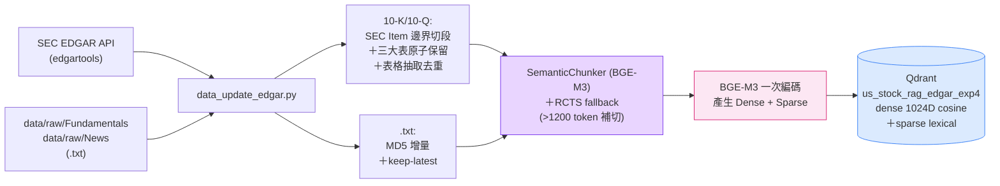
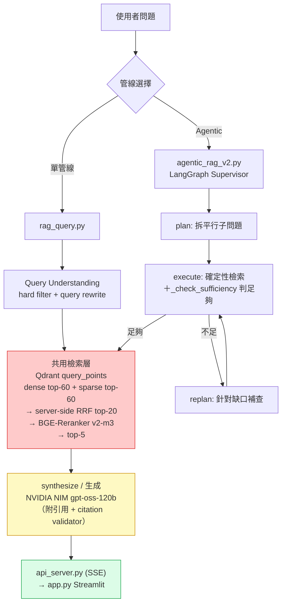

# US Stock Intelligence RAG System

> **HW3 — Build Your Personal RAG System**  
> 主題：美股科技龍頭情報分析（Apple · Microsoft · NVIDIA · Amazon · Alphabet · Meta · Tesla）

### 文件導覽

本檔（README）是**對外說明**：這個系統是什麼、怎麼裝、怎麼跑、為什麼這樣設計。其餘文件各有單一職責：

| 想知道 | 看哪一份 |
|---|---|
| 架構、全域規則、每個檔案負責什麼 | [`CLAUDE.md`](CLAUDE.md) |
| 語料怎麼切塊、重建要注意什麼 | [`docs/INGEST.md`](docs/INGEST.md) |
| 怎麼評測、哪些數字可以相信、**哪些做法已試無效** | [`docs/EVAL.md`](docs/EVAL.md) |
| agentic 管線各節點為什麼這樣設計 | [`docs/AGENTIC.md`](docs/AGENTIC.md) |
| 還沒做的事、已接受的極限 | [`BACKLOG.md`](BACKLOG.md) |
| 什麼時候改了什麼 | [`CHANGELOG.md`](CHANGELOG.md)、[`CHANGELOG_AGENTIC.md`](CHANGELOG_AGENTIC.md) |

---

## 1. 專案簡介

### 知識主題
本系統針對美股七大科技龍頭（**AAPL、MSFT、NVDA、AMZN、GOOGL、META、TSLA**）建構個人知識 RAG 系統，整合：
- **SEC 官方財報**（10-K 年報、10-Q 季報），由 `edgartools` 直接呼叫 SEC EDGAR API 取得
- **基本面財務數據**（P/E、EPS、毛利率、三大財務報表），由 `yfinance` 取得
- **近期市場新聞**，由 `yfinance` 內建 news API 取得條目，並以 `curl_cffi` + `BeautifulSoup` 嘗試補抓全文

### 選題理由
美股科技龍頭財報、法說會實錄、產業分析報告均為公開資料，SEC EDGAR 提供免費 API 存取，`yfinance` 提供完整基本面數據，適合做為 RAG 系統的資料來源。這個領域對量化分析、投資研究有直接應用價值，問答結果對研究人員有真實使用意義。

### 資料規模
| 類別 | 檔案數 | 說明 |
|---|---|---|
| SEC filing（10-K / 10-Q） | 21 | 每家 1 份 10-K ＋ 最近 2 份 10-Q，由 API 即時抓取 |
| Fundamentals / IncomeStatement | 14 | 每家各 2 份 `.txt`，只保留最新快照 |
| News | 24 | `.txt`，多日期並存（時間序列） |
| **合計來源文件** | **59** | → 生產 collection `us_stock_rag_edgar_exp4` 約 **3,650 chunks** |

---

## 2. 系統架構說明

### 2-1. Ingest（建索引）



### 2-2. Query（兩條管線，共用同一個 collection 與檢索層）



> 檔案分工、現行參數、各模組角色（生產／棄用）以 [`CLAUDE.md`](CLAUDE.md) 為單一真相來源。

---

## 3. 設計決策說明（Design Decisions）

### Chunking 策略
- **選擇**：`langchain_experimental` 的 `SemanticChunker`，以 BGE-M3 dense embedding 做語意邊界切割（而非固定字元長度），外加 **RCTS fallback** 補切超長 chunk。
- **理由**：財報和新聞的段落長度落差很大（一句話的財務數據 vs. 整段 MD&A 敘述），固定長度切法要嘛切斷完整語意單元、要嘛留下大量填充。`SemanticChunker` 依相鄰句子的 embedding 相似度斷點切割，讓每個 chunk 是一個語意完整的單元。
- **SEC filing 的額外結構處理**（`data_update_edgar.py`）：
  1. **Item 邊界限制範圍** — 用 edgartools 取得官方 Item 結構（Item 1A / Item 7 / Part I, Item 2…），語意切割只在同一個 Item 內進行，避免不同章節因語意相近被併成同一個 chunk。
  2. **財報三表原子保留** — income statement / balance sheet / cash flow 各自整份保留為一個 chunk，不切不摘要，避免表格結構被破壞。
  3. **附註表格額外抽取＋去重** — 三大表以外的表格（分部營收、稅率調節…）另外從原始 HTML 抽出，並用「大數字集合重疊度」與三大表去重，避免 MD&A 段落重複貼的損益表被算兩次。
- **RCTS fallback（`--rcts-fallback`）**：SemanticChunker 產出的 chunk 若超過 **1200 個 reranker token**，改用 `RecursiveCharacterTextSplitter`（800/80，length function 用 reranker 自己的 tokenizer）補切。
  > 這個旗標**預設是關的但生產必須開**。不開的話約 7.4% 的 chunk 會超過 reranker 的 `RERANK_MAX_LENGTH=2048` 截斷點，超出的內容在精排階段等於看不到。建索引指令見 4-4 ⑥。
- **替代方案考量**：固定長度 + overlap 實作簡單，但財報數字（如「毛利率 75%」）容易被切在 chunk 邊界導致上下文缺失；段落切分（依 `\n\n`）在格式化財報中尚可，但新聞正文段落長度不一致，效果不穩定。

### Embedding 模型
- **選擇**：`BAAI/bge-m3`（FlagEmbedding 本地模型）
- **理由**：
  1. **完全免費 + 開源**，不需要任何 API Key，首次執行自動從 HuggingFace 下載（~2.3GB），之後完全離線
  2. **一個模型同時產生 Dense + Sparse + (Optional ColBERT) 三種向量**——這是 hybrid retrieval 的關鍵需求：避免分別維護兩套 embedding pipeline
  3. 支援 **100+ 語言包含中文**，較舊的 `paraphrase-multilingual-MiniLM-L12-v2` 更強
  4. Dense 向量 1024 維，sparse 為 lexical weight dict（`token_id → weight`），可直接做 dot product 模擬 BM25-like keyword matching
- **替代方案考量**：
  - `paraphrase-multilingual-MiniLM-L12-v2` + `rank_bm25`：模型輕量但需維護兩個獨立元件、且 BM25 是純統計，無語意泛化能力
  - SPLADE 系列：純 sparse，仍需另一個 dense model
  - OpenAI text-embedding-3：品質佳但收費、無 sparse 輸出

### Hybrid Retrieval（混合檢索）+ RRF Fusion
- **動機**：純向量檢索擅長語意相似但會漏掉精確關鍵字（如「毛利率 75%」「Q4 FY2025」）；純關鍵字檢索缺少語意泛化能力。Hybrid 同時利用兩者優勢。
- **架構**（全程在同一個 Qdrant collection 內，dense + sparse 同 point）：
  ```
  query ─► BGE-M3 encode (one shot) ─┬─ q_dense
                                     └─ q_sparse (token_id → weight)
                                              │
                                              ▼
                        client.query_points(  ← single Qdrant API call
                          prefetch=[
                            Prefetch(query=q_dense,  using="dense",  limit=60),
                            Prefetch(query=q_sparse, using="sparse", limit=60),
                          ],
                          query=FusionQuery(fusion=Fusion.RRF),
                          limit=20,          # RRF_TOP_N_PRIMARY
                        )
                                              │
                                              ▼
                        BGE-Reranker v2-m3（cross-encoder，輸入上限 50）
                                              │
                                              ▼
                                         top-5 → LLM
  ```
- **RRF 公式**：`score(d) = Σ 1 / (k + rank_i(d))`，k=60（業界預設經驗值，Qdrant 預設亦為 60）
  - 優勢：rank-based 融合不需校正兩條 retrieval 的 score 尺度（dense cosine ∈ [0,1]，sparse 是無上界 dot product）
  - 對只在單一通道排名靠前的文件友善，又獎勵兩邊都認可的文件
  - 由 Qdrant server 端執行，client 不需手刻 fusion 邏輯
- **參數取捨**：每路 prefetch 取 60（寬召回，Qdrant 取 60 與 30 幾乎同速）；RRF 只回 **20** 而非更多——sweep 顯示 20 > 40，給 reranker 的候選太多反而稀釋信噪比。
- **Sparse 儲存**：直接存進 Qdrant collection 的 `sparse` named vector（`SparseVectorParams`），Qdrant 內部使用 inverted index，與 dense 同樣 sub-millisecond 完成，**不需要額外維護本地 pickle 索引**。
- **Reranker**：`BAAI/bge-reranker-v2-m3` 做最終精排——RRF 雖能融合 rank，但 cross-encoder 對 query-document 做 token-level interaction，相關性判斷更精準。

### Vector DB
- **選擇**：Qdrant（`qdrant-client` Python package）
- **理由**：
  1. **原生支援 hybrid retrieval**：單一 collection 內可定義多個 named vectors（`dense` + `sparse`），一筆 point 同時持有兩種向量，這是 ChromaDB 無法做到的
  2. **Server-side RRF Fusion**：`query_points(prefetch=[...], query=FusionQuery(fusion=Fusion.RRF))` 一次 API call 完成兩路檢索 + 融合
  3. **payload filter + keyword index**：`source` / `doc_type` / `item_id` / `period_basis` / `mentioned_tickers` 都建了 keyword index，供檢索前的硬性條件過濾走索引而非全掃
  4. **可平滑遷移**：`make_qdrant_client()` 依 `.env` 是否設定 `QDRANT_URL` 自動切換 server / local 模式，其餘 code 不變
- **替代方案考量**：
  - **ChromaDB**：原本選擇，但不支援 sparse vector，hybrid retrieval 需把 sparse 額外 pickle 到本地，與 dense 不在同一個 DB 內，架構不一致
  - **Milvus Lite**：同樣原生支援 hybrid，但 API 較複雜，BGE-M3 範例文件較少
  - **pgvector**：需要 Docker + PostgreSQL，sparse 支援需 0.7+ 且設置門檻高
  - **Weaviate**：支援 BM25 + dense，但本地模式需 Docker

### Local mode → Docker Qdrant（架構調整，2026-07）
- **原始設計**：`QdrantClient(path="./qdrant_db")`，local embedded mode，純 Python 不需 Docker。
- **實際踩到的問題**：local mode 是**排他檔案鎖**——同一時間只有一個 process 能開啟 `qdrant_db`。當互動查詢、eval 腳本、`api_server.py` 想要同時或交替存取時，會互搶鎖而報 `AlreadyLocked`。
- **解法**：改跑 Docker Qdrant，`.env` 設定 `QDRANT_URL=http://localhost:6333` 後 `make_qdrant_client()` 自動走 server 模式，允許多 process 併發。
- **Local mode 仍保留**當 fallback：`.env` 不設 `QDRANT_URL` 時自動退回 embedded mode，適合單人單 process 的快速實驗。
- 詳見 [`CHANGELOG.md`](CHANGELOG.md) 2026-07-06 條目。

### Retrieval 策略
- **Top-k**：預設 5（`--top-k` 可調）
- **實際流程**：Qdrant `query_points`（dense top-60 + sparse top-60 → server-side RRF top-20）→ 若觸發 query rewrite，各變體 top-8 去重併入（pool 實際 20~33 個）→ cross-encoder rerank（輸入上限 50）→ top-5
- **相似度度量**：Dense 走 cosine（Qdrant `Distance.COSINE`）；Sparse 走 BGE-M3 lexical weights 的 inverted-index dot product（query 與 doc 共現 token 的加權內積，類 BM25 行為）
- **理由**：財報問答的 context 需要夠豐富但不能太雜——5 個經 hybrid + rerank 精選的 chunk 相關度最高，且遠在生成模型的 context window 之內。

### Query Rewrite（多變體改寫）
- **動機**：口語化 / 開放式問題（例如「輝達的護城河是什麼」）用原始詞面檢索容易漏掉用財報術語寫的段落（CUDA、full-stack platform 等）。
- **做法**：非標準查詢先用 LLM 生成 2 個語意變體（財經術語版），各自檢索後取 **top-8**（`VARIANT_CAP`）併入主池，依 score 去重（同一 chunk 保留較高分版本）。
- **合併策略比較**（`eval/eval_chunk_recall.py --category colloquial` 實測，n=10，nofilter path）：

  | 合併策略 | ckpt_R | critical-miss |
  |---|---|---|
  | 無 rewrite | 51.9% | 50.0% |
  | rewrite（無 cap，全部合併） | 39.1% | 50.0% |
  | **rewrite + 每變體 cap=8**（採用） | **57.1%** | **30.0%** |
  | rewrite + RRF-fusion（跨變體 rank 融合） | 49.0% | 50.0% |

  **無 cap 會被單一強勢變體灌水**——某個變體如果整體分數偏高，會把 pool 塞滿「含關鍵字但沒答到問題」的 chunk，反而壓低 checkpoint recall。RRF-fusion 理論上該解決這個問題（跨 variant 排名而非分數），但實測反而更差：融合出來的 pool 是「各變體排名妥協」的結果，任何單一 query 看都不是最相關的，reranker 拿到的候選反而更雜訊化。**cap=8 是實測最佳解**。細節見 [`CHANGELOG.md`](CHANGELOG.md)。

### Query-Understanding Hard Filter
- **動機**：財報問答常常隱含「限定期間 / 限定文件類型」（例如「上一季」「不要看年報」），若不做限制，reranker 可能選到答錯期間或錯誤公司的 chunk。
- **做法**：檢索前用 LLM 抽取 `fiscal_year` / `fiscal_period` / `filing_type`（含 include/exclude 極性），轉成 Qdrant `must` / `must_not` filter；ticker 則用 regex 字典比對（`_COMPANY_TICKER`）。
- **口徑消歧義（`period_basis`）**：ingest 時就把每個 chunk 標上數字口徑——Fundamentals 是 **TTM**（滾動十二個月快照）、10-K/10-Q/IncomeStatement 是 **fiscal_year**（會計期間結算）。問「最近十二個月」時單向硬性導向 Fundamentals，避免抓到年度結算數字而口徑錯配。
- **Tier cascade**：嚴格 filter 零結果時自動退到寬鬆 filter（拿掉年份留 ticker+type）→ 再退到無 filter，避免「猜錯條件」導致整題查不到東西。
- **已知缺口**：`_COMPANY_TICKER` 只認英文公司名，中文口語問法（「輝達」「特斯拉」）配不到 word boundary，等於該題沒有 ticker 限制，可能讓 filter 跨公司污染候選池。修法（尚未實作）：把 ticker 一併交給同一次 LLM 呼叫抽取，而非只靠 regex。

### Agentic 管線（`agentic_rag_v2.py`）
單管線對「一次要回答多件事」或「必須先查 A 才知道要查 B」的問題力有未逮，因此另建 LangGraph Supervisor 管線：

| 節點 | 做什麼 | 模型 |
|---|---|---|
| `plan` | 把問題拆成可平行處理的子問題 | `gpt-oss-120b` |
| `execute` | **確定性**檢索（無 LLM 改寫），再由 `_check_sufficiency` 判斷證據是否足夠 | 檢索 `gpt-oss-20b`／判定 `gpt-oss-120b` |
| `replan` | 證據不足時針對缺口補查（多跳題的「查完 A 才知道要查 B」在此解決） | `gpt-oss-120b` |
| `synthesize` | 單次生成 ＋ citation validator ＋ reflect | `gpt-oss-120b` |

- **關鍵設計：Execute 不放 LLM 改寫**。早期版本讓 ReAct agent 自由改寫子查詢，實測是檢索品質退步的主因（agent 會把精確的子問題改成模糊的措辭）。改成確定性檢索後，複合問題的 context recall 明顯回升。
- **時間感知雙軸 `freshness_mode`**：`snapshot`（eval 用，「最新」＝知識庫掃出來的最新資料，不看系統時鐘，確保評測可重現）／`live`（生產用，看實際日期）。
- 完整變更史與診斷結論見 [`CHANGELOG_AGENTIC.md`](CHANGELOG_AGENTIC.md)。

### Prompt Engineering
系統提示詞設計原則：
1. 嚴格框架（「僅根據以下參考資料回答」），避免 LLM 憑訓練知識「想像」數字
2. 強制引用格式（`[filename, chunk #N]`），讓使用者可驗證來源
3. 明確處理「不知道」情況（無資料時直接告知，不胡亂推測）
4. **多公司題強制逐家點名**：問題涉及多家公司時，正文必須把每家的風險／數據綁到公司名稱寫進句子（「META faces X; Microsoft faces Y」），citation 標記本身不算 attribution。此規則修復了多公司比較題的泛化敘述失分。

### 生成溫度分工（Temperature Policy）
LLM 呼叫依用途拆成兩種溫度（受控實驗定案，詳見 [`CHANGELOG.md`](CHANGELOG.md) 2026-07-06/07）：
- **檢索側（query filter / query rewrite）與 eval judge：`temperature=0`** — 確定性、可重現，A/B 實驗時檢索結果不因抽樣而變
- **生成答案：`temperature=0.3`（`GEN_TEMPERATURE`）** — 實測 temp=0 的 greedy decoding 會重複 / mode collapse，反而漏掉評分要點（凍住檢索的對照組：correctness 0.518 → 0.609）；0.3 避開 greedy 又遠比預設 ~1.0 穩定

### 冪等性設計（Idempotency）
`data_update_edgar.py` 依資料型態分軌，因為「內容會不會變」對三種來源並不相同：

- **News / Fundamentals / IncomeStatement（`.txt`）** — 計算 MD5 存入 `hashes_edgar.json`，與上次寫入**同一個 collection** 時相同就整檔跳過（連解析／切塊／embedding 都省）。快取以 collection 為第一層 key，避免「A collection 已 ingest 過」誤讓 B collection 跳過。`--force-txt` 可繞過。
- **SEC filing（10-K / 10-Q）** — 不做 hash 快取。filing 一經申報，同一 accession number 內容就不再變動；且內容要呼叫 API 抓回來才存在，事前算不了 hash，加快取省不到 API 呼叫、只省 embedding。改以「依 `source` 刪除舊 points 再 upsert」保證重跑正確。
- **keep-latest（Fundamentals / IncomeStatement）** — 同一公司只保留時間戳最新的一份快照，且**主動刪除過期快照殘留的 chunk**，確保庫裡永遠只有最新一份。靜態財報（10-K/10-Q）則允許多期並存，供查詢歷史財務表現。

共通機制：
- Point ID 使用 deterministic UUID（`uuid5(NAMESPACE_DNS, chunk_id_str)`），同一 chunk 重跑 ID 不變
- `--rebuild` 刪除整個 collection 重建，該 collection 的 MD5 快取一併作廢
- 結果：重複執行不會累積重複 chunk 或過期快照

> **重建不會逐字重現舊 collection**，有兩個正當差異：① `edgartools` 每次抓「最新 10-K ＋ 最近 2 份 10-Q」，SEC 一有新申報就換版 ② 無 caption 的大表格由 LLM 生成摘要，非確定性。判斷重建是否正常，看的是「扣掉換版文件與 LLM caption 後是否逐字相同」，不是總 chunk 數。

---

## 4. 環境設定與執行方式

### 開發環境
- **Python 版本**：3.11.9（需 >= 3.10）
- **作業系統**：Windows 11 / Ubuntu 22.04
- **Vector DB**：Qdrant，推薦跑 Docker server 模式（見 4-2），也支援 local embedded mode 作為單人快速實驗 fallback

### 4-1. 建立虛擬環境

本專案需要**兩個互相隔離的虛擬環境**（原因見下方警告）：

```bash
python --version                       # 需 >= 3.10

# ① 生產環境：查詢、agentic、ingest 都跑在這裡
python -m venv .venv
.venv\Scripts\activate                 # Linux/macOS: source .venv/bin/activate
pip install -r requirements.txt

# ② 評測環境：只給 RAGAS 用
python -m venv .venv-ragas
.venv-ragas\Scripts\activate           # Linux/macOS: source .venv-ragas/bin/activate
pip install -r requirements-ragas.txt
```

> ⚠️ **兩個環境不能合併**：`ragas 0.2.x` 綁 `langchain-core<0.4`，但生產端的 LangGraph agentic 管線與 `SemanticChunker` 需要 `langchain 1.x`。裝在一起時後裝的會覆蓋先裝的版本，結果是生產管線壞掉。實測差異：`.venv` 是 langchain 1.3.14 / langgraph 1.2.9，`.venv-ragas` 是 langchain 0.3.30 / ragas 0.2.15。

> ⚠️ 首次執行時會自動從 HuggingFace 下載 `BAAI/bge-m3`（~2.3GB）與 `BAAI/bge-reranker-v2-m3`（~2.3GB），請確保網路暢通。下載完成後後續執行完全離線。

### 4-2. Vector DB 啟動

**推薦：Docker Qdrant（支援多 process 併發存取）**

```bash
docker run -d --name qdrant_hnsw -p 6333:6333 -v qdrant_storage:/qdrant/storage qdrant/qdrant
```

啟動後在 `.env` 設定 `QDRANT_URL=http://localhost:6333`。所有腳本都透過 `make_qdrant_client()` 自動偵測並走 server 模式。

**替代：Local embedded mode（單人快速實驗，不需 Docker）**

`.env` 把 `QDRANT_URL` 留空即可，自動 fallback 到 `QdrantClient(path=QDRANT_PATH)`，資料庫建在 `./qdrant_db/`。**注意**：local mode 是排他檔案鎖，同一時間只能有一個 process（互動查詢 / eval / API server 三選一）打開它。

### 4-3. 設定環境變數

專案未附 `.env.example`，直接新增 `.env`：

| 變數 | 必填 | 用途 |
|---|---|---|
| `NVIDIA_API_KEY` | ✅ | `rag_query.py` / `agentic_rag_v2.py` 的預設 LLM（NVIDIA NIM `gpt-oss-120b`） |
| `SEC_IDENTITY` | ✅ | 格式 `Your Name your.email@example.com`，SEC EDGAR 公平存取政策要求 |
| `QDRANT_URL` | 建議 | `http://localhost:6333`；留空則走 local embedded mode |
| `GEMINI_API_KEY` | 選用 | 改用 `-m gemini-*` 模型時，以及 ingest 對無 caption 的大表格生成摘要時 |
| `GROQ_API_KEY` | 選用 | 只有 `fetch_data.py` 抓新聞會用 |

### 4-4. 完整執行流程

```bash
# ① 確認 Python 版本、② 建虛擬環境、③ 安裝套件         → 見 4-1
# ④ 建立 .env                                        → 見 4-3
# ⑤ 啟動 Docker Qdrant                                → 見 4-2

# ⑥ 全量重建索引 ── ⚠ --rcts-fallback 不可省（預設是關的）
python data_update_edgar.py --rebuild --rcts-fallback --collection us_stock_rag_edgar_exp4

# ⑦ 單管線問答（不加 -m 就用預設的 NVIDIA gpt-oss-120b）
python rag_query.py -q "NVIDIA 最新財報的毛利率是多少？"
python rag_query.py -q "Apple 目前有什麼有利或是不利的新聞？"
python rag_query.py -q "NVIDIA 最新財報的毛利率是多少？" -m gemini-2.5-flash   # 改走 Gemini

# ⑧ Agentic 管線（多步驟拆解 + 自我檢核，適合複合題 / 多跳題）
python agentic_rag_v2.py -q "比較 NVIDIA 與 Tesla 最新一季的毛利率差距"
python agentic_rag_v2.py -q "..." -v          # 印節點決策與中間輸出

# 互動式多輪對話
python rag_query.py
```

**語料目錄結構**（`data/raw/`，根目錄已無檔案，掃描是遞迴的）：

| 目錄 | 內容 | ingest 行為 |
|---|---|---|
| `Filings/` | 10-K / 10-Q `.html` | 舊管線遺留；EDGAR 版改由 API 取得，**不讀這裡** |
| `Fundamentals/` | Fundamentals + IncomeStatement `.txt` | 讀取，套 keep-latest |
| `News/` | News `.txt` | 讀取，不去重（時間序列） |
| `_archive_stale/` | 過期快照 | **整個目錄排除** |

人眼驗證用的傾印輸出在 `data/edgar_processed/`，鏡像同樣的三分類。

### 4-5. 可選：使用 fetch_data.py 擴充資料

```bash
python fetch_data.py                              # 抓新聞、SEC 財報、基本面
python fetch_data.py --tickers NVDA TSLA GOOGL    # 指定 ticker
python fetch_data.py --news-count 3               # 只抓 3 篇新聞（加速測試）
python fetch_data.py --skip-news --skip-sec       # 只抓基本面（最快）
```

### 4-6. 可選：Web 前端（Streamlit + FastAPI + SSE 串流）

CLI 之外提供瀏覽器聊天介面。架構是 **FastAPI 後端 + Streamlit 前端**，原因是被三個限制綁死：

1. **模型暖機成本高** — BGE-M3 + reranker 載入慢、常駐約 8–10GB RAM，不能每個請求重載 → 後端啟動時載入一次並保持暖機。
2. **職責分離** — 前端純走 HTTP、完全不碰 Qdrant，後端是唯一直接連 Qdrant 的 process。
3. **CPU rerank 每題數分鐘** → 用 SSE 串流，並在出 token 前先回報「檢索中／重排中／生成中」。

```powershell
# 視窗 A：後端（載入模型）
uvicorn api_server:app --port 8000
#   生成模型沿用 rag_query 預設（NVIDIA NIM gpt-oss-120b）；
#   要改走 Gemini 則在請求端指定 gemini-* 模型名。

# 視窗 B：前端（純 HTTP client，不碰向量庫）
streamlit run app.py
```

健康檢查：`GET http://localhost:8000/health` 回報實際 collection 名稱與 chunk 數，可立即確認模型載入、Qdrant 連上、collection 選對。

---

## 5. 評測（Evaluation）

| 項目 | 內容 |
|---|---|
| 題庫 | [`eval/eval_set.json`](eval/eval_set.json)，**100 題**：news / multi_intent / semantic / mixed / lexical / colloquial 各 15，＋ multi_hop 10 |
| 參考答案 | `gen_reference_answers.py` 從黃金來源檔生成 → `reference_answers.json`（RAGAS 的 ground truth） |
| 指標 | RAGAS 六項：context_recall、context_precision、nv_context_relevance、faithfulness、answer_relevancy、answer_correctness |
| 執行環境 | RAGAS 須跑在**獨立的 `.venv-ragas`**（`ragas==0.2.15` 綁 `langchain-core<0.4`，裝進生產 `.venv` 會把 langchain 降版、弄壞 agentic 管線與 SemanticChunker） |

標準跑法（三步，reference 生成一次即可重用）：

```bash
# 1. 生成參考答案
python eval/gen_reference_answers.py

# 2. 產生結果檔（agentic 版；單管線版改跑 eval_generation_llm_judge.py）
python eval/run_agentic_on_evalset.py --module agentic_rag_v2

# 3. 切到 .venv-ragas 算指標
.venv-ragas/Scripts/python.exe eval/eval_ragas_vs_rubric.py \
    --from-results <結果檔> --reference-file eval/reference_answers.json --output <輸出>
```

> 腳本清單與各自跑在哪個 venv，見 [`CLAUDE.md`](CLAUDE.md) 的 Eval 表。實驗結論記錄在 [`CHANGELOG.md`](CHANGELOG.md) 與 [`CHANGELOG_AGENTIC.md`](CHANGELOG_AGENTIC.md)。

---

## 6. 資料來源聲明（Data Sources Statement）

| 來源名稱 | 類型 | 授權 / 合規依據 | 數量 |
|---|---|---|---|
| SEC EDGAR（10-K / 10-Q） | 官方財報 | 美國 SEC 公開資料，完全免費公開 | 每公司 3 份（1 年報 + 2 季報），共 21 |
| Yahoo Finance（yfinance） | 基本面數據 | Yahoo Finance 公開服務條款，個人使用合規 | 每公司 2 份，共 14 |
| Yahoo Finance News API + 公開新聞頁正文擷取 | 新聞文章 | 以 `yfinance` news API 取得條目，並擷取公開頁面可讀內容作為補充 | 共 24 篇 |

> ⚠️ 所有資料均來自公開管道，不含任何付費牆內容或重大非公開資訊（MNPI）。  
> SEC EDGAR 的存取遵守其公平存取政策：`.env` 需提供 `SEC_IDENTITY`（真實姓名 + email），並限制請求頻率。

---

## 7. 系統限制與未來改進

### 當前限制
1. **中文口語 ticker 抽取缺口** — `_COMPANY_TICKER` 只認英文公司名，「輝達」「特斯拉」等中文口語問法配不到，該題等於沒有 ticker 硬性限制，可能跨公司污染候選池。
2. **否定框架的檢索落差** — 「非龍頭」「不是最大的」這類否定框架問題，與語料裡的正面表述（"minority share"）存在框架落差，跨語言翻譯救不了，屬已知限制。
3. **新聞來源以英文財經媒體為主** — `fetch_data.py` 依賴 Yahoo Finance news feed 與公開新聞頁面，中文財經媒體支援有限。
4. **表格摘要非確定性** — 無 caption 的大表格靠 LLM 生成一行摘要，未固定 temperature 且有 output token 上限，導致重建索引時這部分無法逐字重現。
5. **CPU rerank 延遲** — cross-encoder 在 CPU 上每題數分鐘，互動體驗依賴 SSE 串流的階段回報來緩解。

### 未來改進方向
1. **複雜度 router** — 依問題複雜度自動分派：簡單題走單管線（快），複雜題走 agentic（準）。設計已完成，待量測驗證後上線。
2. **ticker 抽取併入 LLM** — 解決上述限制 1，把 ticker 與期間／文件類型一起在同一次 LLM 呼叫中抽取。
3. **BGE-M3 ColBERT multi-vector 三路融合** — 目前只用 dense + sparse 兩路，可再加 ColBERT 細粒度交互打分。
4. **GraphRAG 知識圖譜** — 建立公司 → 產品 → 技術 → 競爭者的關係圖，提升多跳推理能力。
5. **新聞定期自動更新** — 整合 RSS 解析，每日增量更新新聞語料。

---

## 8. 常見問題

**Q：重建索引時可以省略 `--rcts-fallback` 嗎？**  
A：**不行**。這個旗標預設是關的，但生產索引必須開。不開的話約 7.4% 的 chunk 會超過 reranker 的 2048 token 截斷點（開啟時只有 0.1%），超出部分在精排階段等於看不到；總 chunk 數也會少約 12%。

**Q：首次執行卡在 Embedding 模型下載？**  
A：首次會自動從 HuggingFace 下載 `BAAI/bge-m3`（~2.3GB，含 dense + sparse + colbert 三個 head）與 `BAAI/bge-reranker-v2-m3`（~2.3GB）。請確保網路暢通並耐心等待，之後完全離線。

**Q：Qdrant 要不要跑 Docker？**  
A：推薦跑 Docker。最初設計是純 Python 嵌入式模式不需 Docker，但那是**排他檔案鎖**——同一時間只能有一個 process 開啟資料庫，互動查詢 / eval / API server 之間會互搶鎖而報錯。改跑 Docker 後三者可併發。單人單 process 快速實驗仍可把 `QDRANT_URL` 留空 fallback 回 local mode。

**Q：`fetch_data.py` 抓新聞失敗（`curl_cffi` / HTML 解析失敗）？**  
A：部分財經網站會阻擋全文抓取，可能出現 401/403、逾時，或頁面結構變動導致解析失敗。程式已內建 `try/except`；抓不到全文時自動退回 `yfinance` 提供的 snippet，不影響整體執行。也可用 `--skip-news` 跳過。

**Q：edgartools 連接 SEC EDGAR 超時？**  
A：SEC EDGAR 會限速過於頻繁的請求，且要求 `SEC_IDENTITY` 提供真實聯絡資訊。若仍超時，用 `--tickers NVDA` 縮小範圍分批跑，或稍後重試。（`--skip-txt` 是跳過 `.txt` 那半邊，對 SEC 超時沒有幫助。）

**Q：單管線和 agentic 該用哪個？**  
A：單一事實查詢（「NVIDIA 最新毛利率」）用單管線即可，快且準。涉及多個子問題（「比較 A 和 B，再加上新聞面」）或需要多跳推理（「先查出誰是最大客戶，再查那家公司的財務」）時用 agentic。自動分派的 router 尚未上線，目前需手動選擇。

**Q：可以使用 pgvector / Milvus 而非 Qdrant 嗎？**  
A：可以，但需重寫 DB 層。Qdrant 之所以被選中，是因為它在 hybrid retrieval（dense + sparse named vectors + server-side RRF）的支援最完整、API 最簡潔，且提供 local embedded mode 可選。pgvector 需要 PostgreSQL 容器；Milvus 需要 etcd + MinIO（或 Milvus Lite）。
